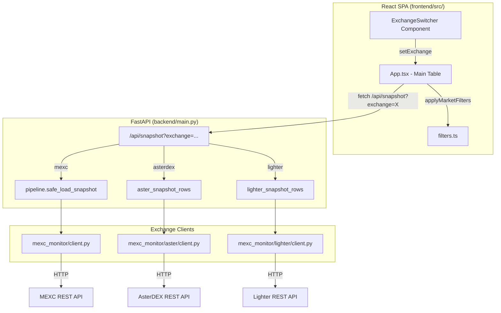
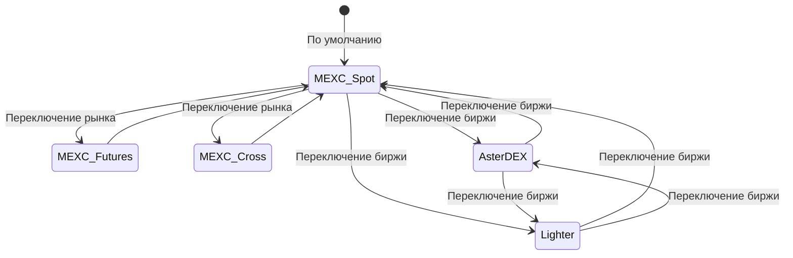

# Design Document: Exchange Switcher

## Overview

Функция добавляет переключатель бирж (Exchange Switcher) в основное окно React SPA приложения MEXC Spread Monitor. Вместо отдельных панелей (как текущая `AsterDexPanel`) пользователь сможет переключаться между MEXC (spot), AsterDEX и Lighter прямо в главной таблице данных. Также включает интеграцию нового Python-клиента для DEX-биржи Lighter.

**Ключевые решения:**
- Переключатель реализуется как группа кнопок-табов в верхней панели `App.tsx`, заменяя текущий переключатель `spot/futures/cross` для MEXC на двухуровневую навигацию: сначала биржа, затем (для MEXC) рынок.
- Бэкенд предоставляет единый эндпоинт `/api/snapshot` с новым параметром `exchange`, возвращающий данные в унифицированном формате `Unified_Ticker_Row`.
- Lighter-клиент следует паттерну `AsterPublicClient` — отдельный модуль `mexc_monitor/lighter/client.py`.

## Architecture



### Двухуровневая навигация

Для MEXC сохраняется текущий переключатель рынков (spot/futures/cross). Для AsterDEX и Lighter — единый рынок (perp futures), поэтому переключатель рынков скрывается.



## Components and Interfaces

### Frontend

#### ExchangeSwitcher Component

```typescript
type Exchange = "mexc" | "asterdex" | "lighter";

interface ExchangeSwitcherProps {
  active: Exchange;
  onChange: (exchange: Exchange) => void;
  disabled?: boolean;
}
```

Компонент рендерит три кнопки-таба с визуальным выделением активной биржи. Располагается в верхней панели `App.tsx` перед переключателем рынков.

#### Изменения в App.tsx

- Новый state: `const [exchange, setExchange] = useState<Exchange>("mexc")`
- При `exchange !== "mexc"` — скрывается переключатель рынков (spot/futures/cross), используется фиксированный market type
- Функция `load()` передаёт `exchange` параметр в запрос `/api/snapshot`
- При смене `exchange` — очистка `rows`, сброс `loadedAt`, вызов `load()`
- Фильтры (`search`, `sortBy`, `ascending`) **сохраняются** при переключении биржи
- `quoteRaw` сбрасывается на "USDT" при переключении на AsterDEX/Lighter

#### Изменения в types.ts

```typescript
export type Exchange = "mexc" | "asterdex" | "lighter";

// Market type расширяется для DEX-бирж
export type DexMarket = "perp";

// SnapshotResponse дополняется
export interface SnapshotResponse {
  // ... existing fields
  exchange?: Exchange;
}
```

### Backend

#### Расширение `/api/snapshot`

```python
@app.get("/api/snapshot")
def snapshot(
    market: str = Query("spot", description="spot, futures или cross"),
    exchange: str = Query("mexc", description="mexc, asterdex или lighter"),
    nocache: bool = Query(False),
) -> dict:
```

При `exchange="mexc"` — текущая логика без изменений.
При `exchange="asterdex"` — вызов `aster_snapshot_rows()` → нормализация в `Unified_Ticker_Row`.
При `exchange="lighter"` — вызов `lighter_snapshot_rows()` → нормализация.
При неизвестном значении — HTTP 400 с `{"error": "Unknown exchange", "supported": ["mexc", "asterdex", "lighter"]}`.

#### Нормализация данных (Unified_Ticker_Row)

Все биржи возвращают данные в едином формате, совместимом с существующим `MarketRow`:

```python
@dataclass(frozen=True)
class UnifiedTickerRow:
    symbol: str          # e.g. "BTCUSDT"
    bid: float
    ask: float
    bid_qty: float
    ask_qty: float
    mid: float
    spread_abs: float
    spread_bps: float | None
    volume_24h_base: float
    volume_24h_quote: float
    funding_rate: float | None = None
    observed_at: str | None = None
```

Это по сути тот же `BookTickerRow` без полей execution model (fee, net_spread, l1). Для DEX-бирж execution model не применяется (нулевые комиссии у Lighter, свои у AsterDEX).

### Lighter Client Module

#### Структура `mexc_monitor/lighter/`

```
mexc_monitor/lighter/
├── __init__.py
├── client.py       # LighterPublicClient
```

#### LighterPublicClient

```python
class LighterPublicClient:
    """Публичный клиент Lighter DEX (без аутентификации)."""

    def __init__(
        self,
        base_url: str = "https://mainnet.zklighter.elliot.ai",
        timeout_sec: float = 15.0,
    ):
        ...

    def orderbook_details(self, filter: str = "perp") -> list[LighterMarketInfo]:
        """GET /api/v1/orderBookDetails — метаданные рынков."""
        ...

    def orderbook_orders(self, market_id: int, limit: int = 5) -> LighterOrderbook:
        """GET /api/v1/orderBookOrders — ордера в стакане (bid/ask)."""
        ...

    def orderbooks(self, filter: str = "perp") -> list[LighterOrderbookSummary]:
        """GET /api/v1/orderBooks — сводка по рынкам (best bid/ask)."""
        ...

    def funding_rates(self) -> list[LighterFundingRate]:
        """GET /api/v1/funding-rates — текущие funding rates."""
        ...
```

**Ключевые эндпоинты Lighter API:**
- `GET /api/v1/orderBooks` — метаданные всех рынков (best bid/ask, volume)
- `GET /api/v1/orderBookOrders?market_id=X&limit=N` — ордера в стакане
- `GET /api/v1/orderBookDetails` — информация о рынках (decimals, min amounts)
- `GET /api/v1/funding-rates` — текущие funding rates

Base URL: `https://mainnet.zklighter.elliot.ai`

#### Нормализация Lighter → UnifiedTickerRow

```python
def lighter_snapshot_rows(client: LighterPublicClient) -> list[BookTickerRow]:
    """Получить тикеры Lighter и нормализовать в BookTickerRow."""
    orderbooks = client.orderbooks(filter="perp")
    details = client.orderbook_details(filter="perp")
    # Map market_id → symbol name, decimals
    # Normalize prices using supported_price_decimals
    # Compute mid, spread_abs, spread_bps
    # Return list of BookTickerRow
```

## Data Models

### Конфигурация Lighter в `config/external_apis.json`

```json
{
  "lighter": {
    "base_url": "https://mainnet.zklighter.elliot.ai",
    "timeout_sec": 15,
    "endpoints": {
      "orderbooks": "/api/v1/orderBooks",
      "orderbook_details": "/api/v1/orderBookDetails",
      "orderbook_orders": "/api/v1/orderBookOrders",
      "funding_rates": "/api/v1/funding-rates",
      "candles": "/api/v1/candles"
    }
  }
}
```

### Dataclasses для Lighter

```python
@dataclass(frozen=True)
class LighterMarketInfo:
    market_id: int
    symbol: str           # e.g. "ETH-PERP"
    base_asset: str       # e.g. "ETH"
    quote_asset: str      # e.g. "USD"
    price_decimals: int
    size_decimals: int
    min_base_amount: float
    min_quote_amount: float
    taker_fee_pct: float
    maker_fee_pct: float

@dataclass(frozen=True)
class LighterOrderbookSummary:
    market_id: int
    best_bid: float
    best_ask: float
    best_bid_qty: float
    best_ask_qty: float
    volume_24h: float
    last_price: float

@dataclass(frozen=True)
class LighterFundingRate:
    market_id: int
    funding_rate: float
    next_funding_time: int
```

### Маппинг символов

Lighter использует `market_id` (int) для идентификации рынков. Маппинг `market_id → symbol` получается из `orderBookDetails`. Символы нормализуются в формат `ETHUSDT` (без дефисов и суффикса `-PERP`) для совместимости с UI.

### Состояние фронтенда

```typescript
// Новые state в App.tsx
const [exchange, setExchange] = useState<Exchange>("mexc");

// Модифицированный fetch
const url = apiUrl(`/api/snapshot?market=${market}&exchange=${exchange}`);
```

## Correctness Properties

*A property is a characteristic or behavior that should hold true across all valid executions of a system — essentially, a formal statement about what the system should do. Properties serve as the bridge between human-readable specifications and machine-verifiable correctness guarantees.*

### Property 1: Exchange switch displays only target exchange data

*For any* pair of exchanges (A, B) and any state of the application, when the user switches from exchange A to exchange B, the Main_Table shall display only data originating from exchange B and no rows from exchange A shall remain visible.

**Validates: Requirements 2.1, 2.4**

### Property 2: Unified format normalization

*For any* valid raw ticker data from any supported exchange (MEXC, AsterDEX, Lighter), the normalization function shall produce a valid Unified_Ticker_Row containing all required fields (symbol, bid, ask, bid_qty, ask_qty, mid, spread_abs, spread_bps) with correct mathematical relationships (mid = (bid+ask)/2, spread_abs = ask-bid, spread_bps = 10000 * spread_abs / mid).

**Validates: Requirements 2.3, 5.2**

### Property 3: Error messages include exchange name

*For any* exchange and any API error condition, the error message displayed to the user shall contain the name of the exchange that failed.

**Validates: Requirements 2.5**

### Property 4: Filter and sort state preservation across exchange switches

*For any* filter configuration (search text, sort column, sort direction) and any pair of exchanges, switching the active exchange shall preserve all filter/sort settings and apply them correctly to the new data set.

**Validates: Requirements 3.1, 3.2, 3.3**

### Property 5: Unknown exchange validation

*For any* string that is not in the set {"mexc", "asterdex", "lighter"}, the `/api/snapshot` endpoint shall return HTTP 400 with a response body containing the list of supported exchanges.

**Validates: Requirements 4.5**

### Property 6: Lighter data normalization round-trip consistency

*For any* valid Lighter orderbook response with positive bid and ask prices, the normalization to BookTickerRow shall produce mathematically consistent values: `mid == (bid + ask) / 2`, `spread_abs == ask - bid`, and `spread_bps == 10000 * spread_abs / mid` (within floating point tolerance).

**Validates: Requirements 5.2**

### Property 7: Auto-refresh targets only active exchange

*For any* active exchange with auto-refresh enabled, all periodic data fetches shall target only the currently active exchange, and switching the exchange shall immediately trigger a fetch for the new exchange and restart the refresh cycle.

**Validates: Requirements 7.1, 7.2**

## Error Handling

### Frontend

| Сценарий | Поведение |
|----------|-----------|
| API возвращает `ok: false` | Показать `error` из ответа с именем биржи в сообщении |
| Сетевая ошибка (timeout, network) | Показать "Ошибка загрузки данных {exchange}: {message}" |
| Пустой ответ (rows: []) | Показать таблицу с сообщением "Нет данных для {exchange}" |
| Переключение во время загрузки | Abort предыдущего запроса через `AbortController` (текущий паттерн) |

### Backend

| Сценарий | Поведение |
|----------|-----------|
| Неизвестная биржа | HTTP 400: `{"ok": false, "error": "Unknown exchange: X", "supported": ["mexc", "asterdex", "lighter"]}` |
| Lighter API недоступен | HTTP 200: `{"ok": false, "error": "Lighter API error: ...", "market": "perp", "rows": [], "count": 0}` |
| AsterDEX API недоступен | HTTP 200: `{"ok": false, "error": "AsterDEX API error: ...", "market": "perp", "rows": [], "count": 0}` |
| Timeout при запросе к бирже | Пробрасывается как ошибка с описательным сообщением |
| Невалидный JSON от биржи | `LighterApiError` / `AsterApiError` с описанием |

### Конфигурация

| Сценарий | Поведение |
|----------|-----------|
| Секция "lighter" отсутствует в config | Использовать defaults: `base_url="https://mainnet.zklighter.elliot.ai"`, `timeout_sec=15` |
| Невалидный base_url | Ошибка при первом запросе, пробрасывается как `LighterApiError` |

## Testing Strategy

### Unit Tests (pytest + vitest)

**Backend (pytest):**
- Нормализация данных Lighter → BookTickerRow (корректность вычислений mid, spread)
- Нормализация данных AsterDEX → BookTickerRow
- Обработка невалидных данных (отсутствующие поля, нулевые цены)
- Чтение конфигурации Lighter из JSON (defaults, overrides)
- Валидация параметра `exchange` в эндпоинте

**Frontend (vitest):**
- ExchangeSwitcher рендерит три опции
- Переключение биржи вызывает onChange
- Состояние фильтров сохраняется при смене exchange
- Корректная формация URL с параметром exchange

### Property-Based Tests (Hypothesis для Python, fast-check для TypeScript)

**Библиотека:** `hypothesis` (Python), `fast-check` (TypeScript/vitest)

Каждый property-тест запускается минимум 100 итераций и помечен тегом:

- **Feature: exchange-switcher, Property 2: Unified format normalization** — генерация случайных ticker-данных, проверка математической корректности нормализации
- **Feature: exchange-switcher, Property 4: Filter and sort state preservation** — генерация случайных фильтров и данных, проверка что фильтры применяются корректно после "переключения"
- **Feature: exchange-switcher, Property 5: Unknown exchange validation** — генерация случайных строк не из множества валидных бирж, проверка HTTP 400
- **Feature: exchange-switcher, Property 6: Lighter data normalization round-trip consistency** — генерация случайных orderbook данных с положительными ценами, проверка математических инвариантов

### Integration Tests

- Реальный запрос к Lighter API (с пометкой `@pytest.mark.integration`)
- Реальный запрос к AsterDEX API
- End-to-end: frontend → backend → exchange API (manual/CI)

### Что НЕ покрывается PBT

- UI layout и позиционирование (визуальные тесты)
- Реальная связность с внешними API (integration tests)
- Auto-refresh timing (сложно тестировать property-based, используем example-based)
