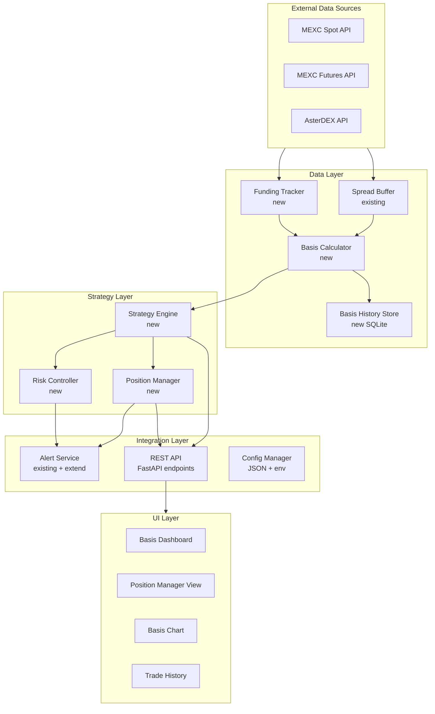

# Design Document: Futures/Spot Arbitrage

## Overview

Модуль **Futures/Spot Arbitrage** расширяет существующую систему MEXC Spread Monitor стратегиями арбитража между спотовым и фьючерсным (перпетуальным) рынками. В отличие от существующего `ArbitrageEngine` (кросс-биржевой арбитраж MEXC ↔ AsterDEX на одном инструменте с удержанием секунды-минуты), новый модуль работает с **двумя разными типами инструментов** (спот и перп) и предполагает удержание позиции от минут до дней с накоплением funding-платежей.

### Ключевые отличия от существующего арбитража

| Аспект | Существующий (cross-exchange) | Новый (futures-spot) |
|--------|-------------------------------|----------------------|
| Инструменты | Один и тот же (BTCUSDT на двух биржах) | Разные (спот + перп) |
| Удержание | Секунды–минуты | Минуты–дни |
| Доход | Конвергенция спреда | Базис + funding payments |
| Риски | Execution risk | Margin, delta, basis divergence |
| Exchange combos | MEXC ↔ AsterDEX | MEXC Spot+Futures, MEXC Spot+AsterDEX Perp, AsterDEX+MEXC Futures |

### Стратегии

1. **Cash-and-Carry**: Покупка спота + шорт фьючерса при премии перпа → доход от конвергенции базиса + положительный funding
2. **Reverse Cash-and-Carry**: Шорт спота + лонг фьючерса при дисконте перпа → доход от обратной конвергенции
3. **Funding Rate Arbitrage**: Дельта-нейтральная позиция для сбора funding-платежей при высоких ставках

## Architecture



### Интеграция с существующей архитектурой

- **Spread Buffer** (`mexc_monitor/spread_buffer.py`): Используется как источник real-time bid/ask для спотовых и фьючерсных инструментов. Basis Calculator подписывается на обновления через существующий механизм `subscribe()`.
- **Alert Service** (`mexc_monitor/alerts/service.py`): Расширяется новыми методами для futures-arb алертов (position open/close, risk alerts, funding alerts).
- **ORM** (`mexc_monitor/orm/`): Добавляется новая модель `BasisSnapshot` для хранения истории базиса в SQLite.
- **Backend API** (`backend/main.py`): Добавляются новые endpoints `/api/futures-arb/*`.
- **Exchange Adapters** (`mexc_monitor/arbitrage/adapters.py`): Переиспользуются `MexcSpotAdapter` и `AsterDexAdapter`; добавляется `MexcFuturesAdapter` для фьючерсных ордеров.

### Размещение файлов

```
mexc_monitor/
├── futures_arb/
│   ├── __init__.py
│   ├── models.py           # Dataclasses: FuturesArbSettings, FuturesArbPosition, etc.
│   ├── basis_calculator.py # Расчёт базиса в реальном времени
│   ├── funding_tracker.py  # Отслеживание funding rates
│   ├── strategy_engine.py  # Основной движок стратегий
│   ├── position_manager.py # Управление позициями, PNL, сериализация
│   ├── risk_controller.py  # Контроль рисков
│   ├── config.py           # Загрузка/валидация конфигурации
│   └── basis_store.py      # Запись истории базиса в SQLite
frontend/src/
├── FuturesArbPanel.tsx     # Основная панель (дашборд + позиции + история)
├── BasisChart.tsx           # График базиса с маркерами
```

## Components and Interfaces

### 1. Basis Calculator (`basis_calculator.py`)

Компонент, вычисляющий базис между спотовым и фьючерсным инструментами в реальном времени.

```python
@dataclass
class BasisSnapshot:
    symbol: str
    exchange_combo: str          # "mexc_spot+mexc_futures" | "mexc_spot+asterdex_perp" | "asterdex_perp+mexc_futures"
    spot_mid: float
    futures_mid: float
    basis_abs: float             # futures_mid - spot_mid
    basis_bps: float             # 10000 * basis_abs / spot_mid
    executable_basis_cc_bps: float   # cash-and-carry: (futures_bid - spot_ask) / spot_mid * 10000 - fees
    executable_basis_rcc_bps: float  # reverse: (spot_bid - futures_ask) / spot_mid * 10000 - fees
    estimated_apy: float         # annualized yield
    funding_rate: float | None
    status: Literal["active", "stale"]
    timestamp_ms: int

class BasisCalculator:
    def __init__(self, settings: FuturesArbSettings): ...
    def get_current_basis(self, symbol: str, exchange_combo: str) -> BasisSnapshot | None: ...
    def get_all_basis(self) -> list[BasisSnapshot]: ...
    def start(self) -> None: ...
    def stop(self) -> None: ...
```

**Логика:**
- Подписывается на Spread Buffer для получения bid/ask обоих ног
- Пересчитывает базис при каждом обновлении любой ноги (latency < 500ms)
- Помечает пару как "stale" если данные одной ноги старше `stale_after_sec`
- Вычисляет executable basis с учётом комиссий обеих ног
- Вычисляет estimated APY: `(basis_bps / 10000) * (365 * 24 / expected_hold_hours) * 100`

### 2. Funding Tracker (`funding_tracker.py`)

Компонент для отслеживания funding rates перпетуальных контрактов.

```python
@dataclass
class FundingInfo:
    symbol: str
    exchange: str                # "mexc_futures" | "asterdex_perp"
    current_rate: float
    next_funding_time_ms: int
    avg_7d: float
    avg_30d: float
    annualized_yield: float
    direction_changed: bool

class FundingTracker:
    def __init__(self, settings: FuturesArbSettings): ...
    def get_funding(self, symbol: str, exchange: str) -> FundingInfo | None: ...
    def get_all_funding(self) -> list[FundingInfo]: ...
    def start(self) -> None: ...
    def stop(self) -> None: ...
```

**Логика:**
- Опрашивает funding rate каждые 60 секунд через REST API (MEXC: `/api/v1/contract/funding_rate`, AsterDEX: `/fapi/v1/premiumIndex`)
- Хранит историю за 30 дней в памяти (deque)
- Вычисляет средние за 7d и 30d
- Генерирует событие `funding_direction_changed` при смене знака
- Вычисляет annualized yield: `rate * (365 * 24 / interval_hours) * 100`

### 3. Strategy Engine (`strategy_engine.py`)

Основной движок, координирующий стратегии арбитража.

```python
class FuturesArbStrategyEngine:
    def __init__(self, settings: FuturesArbSettings): ...
    
    # Lifecycle
    def start(self) -> dict: ...
    def stop(self) -> dict: ...
    def get_status(self) -> dict: ...
    
    # Settings
    def update_settings(self, patch: dict) -> dict: ...
    
    # Internal loop
    def _step(self) -> None: ...
    def _check_entry_opportunities(self) -> None: ...
    def _evaluate_cash_and_carry(self, symbol: str, combo: str) -> None: ...
    def _evaluate_reverse_cash_and_carry(self, symbol: str, combo: str) -> None: ...
    def _evaluate_funding_arbitrage(self, symbol: str, combo: str) -> None: ...
```

**Логика:**
- Фоновый поток с настраиваемым `loop_interval_sec`
- На каждом шаге: проверка открытых позиций → проверка новых возможностей
- Поддержка paper/live режимов с идентичной логикой
- Атомарное открытие обеих ног с one-leg protection
- Выбор лучшего exchange_combo при нескольких вариантах для одного символа

### 4. Position Manager (`position_manager.py`)

Управление открытыми позициями, PNL-учёт, сериализация.

```python
@dataclass
class FuturesArbPosition:
    id: str                      # UUID
    symbol: str
    exchange_combo: str
    strategy: Literal["cash_and_carry", "reverse_cash_and_carry", "funding_arb"]
    state: Literal["pending_open", "open", "pending_close", "closed"]
    # Spot leg
    spot_side: Literal["buy", "sell"]
    spot_entry_price: float
    spot_qty: float
    # Futures leg
    futures_side: Literal["long", "short"]
    futures_entry_price: float
    futures_qty: float
    futures_leverage: int
    # Tracking
    notional_usdt: float
    entry_basis_bps: float
    open_time_ms: int
    # PNL
    basis_pnl: float
    cumulative_funding: float
    entry_fees: float
    exit_fees: float
    total_pnl: float
    # Close
    close_time_ms: int
    close_reason: str
    exit_basis_bps: float

class PositionManager:
    def __init__(self, state_file: str): ...
    def open_position(self, pos: FuturesArbPosition) -> None: ...
    def close_position(self, position_id: str, reason: str, ...) -> FuturesArbPosition: ...
    def update_funding(self, position_id: str, amount: float) -> None: ...
    def get_open_positions(self) -> list[FuturesArbPosition]: ...
    def get_closed_positions(self, limit: int, offset: int) -> list[FuturesArbPosition]: ...
    def get_stats(self) -> FuturesArbStats: ...
    def serialize_state(self) -> None: ...
    def deserialize_state(self) -> None: ...
```

### 5. Risk Controller (`risk_controller.py`)

Контроль рисков арбитражных позиций.

```python
@dataclass
class RiskAlert:
    level: Literal["warning", "critical"]
    alert_type: str              # "margin_warning", "margin_critical", "delta_imbalance", etc.
    symbol: str
    message: str
    timestamp_ms: int

class RiskController:
    def __init__(self, settings: FuturesArbSettings): ...
    def check_position(self, pos: FuturesArbPosition) -> list[RiskAlert]: ...
    def check_total_exposure(self, positions: list[FuturesArbPosition]) -> list[RiskAlert]: ...
    def is_kill_switch_active(self) -> bool: ...
    def activate_kill_switch(self) -> None: ...
    def deactivate_kill_switch(self) -> None: ...
```

**Проверки:**
- Margin ratio фьючерсной ноги каждые 30 секунд
- Дельта-нейтральность: `|spot_notional - futures_notional| / avg_notional * 100 < max_delta_imbalance_percent`
- Суммарный exposure: `sum(pos.notional_usdt) < max_total_exposure_usdt`
- Per-symbol exposure: `sum(pos.notional_usdt for same symbol) < max_per_symbol_notional_usdt`
- Kill switch: закрытие всех позиций, блокировка новых

### 6. Basis History Store (`basis_store.py`)

Периодическая запись базиса в SQLite (аналогично `CrossSpreadWorker`).

```python
class BasisHistoryStore:
    def __init__(self, db_path: str, interval_sec: float, retention_days: int): ...
    def start(self) -> None: ...
    def stop(self) -> None: ...
    def query_history(self, symbol: str, exchange_combo: str, since: str, until: str, limit: int) -> list[dict]: ...
```

### 7. REST API Endpoints

Все endpoints под префиксом `/api/futures-arb/`:

| Method | Path | Description |
|--------|------|-------------|
| GET | `/api/futures-arb/status` | Статус движка + текущие базисы |
| GET | `/api/futures-arb/positions` | Открытые позиции с real-time PNL |
| GET | `/api/futures-arb/history` | Закрытые позиции (paginated) |
| POST | `/api/futures-arb/start` | Запуск движка |
| POST | `/api/futures-arb/stop` | Остановка движка |
| PATCH | `/api/futures-arb/settings` | Обновление конфигурации |
| GET | `/api/futures-arb/basis-history` | История базиса для графика |
| POST | `/api/futures-arb/close-position` | Ручное закрытие позиции |

### 8. Frontend Components

**FuturesArbPanel.tsx** — модальная панель (аналогично `ArbitragePanel.tsx`):
- Табы: Дашборд | Позиции | История | График | Настройки
- Polling каждые 3 секунды для обновления данных
- Использует `lightweight-charts` для графика базиса

## Data Models

### Configuration (`FuturesArbSettings`)

```python
@dataclass
class FuturesArbSettings:
    enabled: bool = False
    mode: Literal["paper", "live"] = "paper"
    
    # Symbols & combos
    symbols: list[str] = field(default_factory=lambda: ["BTCUSDT", "ETHUSDT"])
    exchange_combos: list[str] = field(default_factory=lambda: ["mexc_spot+mexc_futures"])
    
    # Entry/exit thresholds
    entry_threshold_bps: float = 30.0
    exit_threshold_bps: float = 5.0
    max_basis_divergence_bps: float = 100.0
    target_profit_bps: float = 50.0
    
    # Funding
    funding_entry_threshold: float = 0.001  # 0.1%
    funding_consecutive_periods_exit: int = 3
    
    # Position sizing
    position_notional_usdt: float = 1000.0
    max_concurrent_positions: int = 5
    max_per_symbol_notional_usdt: float = 3000.0
    max_total_exposure_usdt: float = 10000.0
    futures_leverage: int = 3
    
    # Timing
    max_hold_duration_hours: float = 168.0  # 7 days
    max_leg_pending_sec: float = 30.0
    loop_interval_sec: float = 1.0
    expected_hold_hours: float = 24.0
    
    # Risk
    margin_warning_threshold: float = 0.5   # 50%
    margin_critical_threshold: float = 0.3  # 30%
    max_delta_imbalance_percent: float = 5.0
    critical_delta_imbalance_percent: float = 15.0
    kill_switch: bool = False
    
    # Fees (bps, one-way)
    spot_taker_fee_bps: float = 1.0
    futures_taker_fee_bps: float = 2.0
    
    # History
    basis_history_interval_sec: float = 60.0
    basis_history_retention_days: int = 90
    
    # Alerts
    funding_alert_threshold: float = 0.005  # 0.5%
```

### Position State (for serialization)

```python
@dataclass
class FuturesArbPosition:
    id: str
    symbol: str
    exchange_combo: str
    strategy: str
    state: str
    spot_side: str
    spot_entry_price: float
    spot_qty: float
    futures_side: str
    futures_entry_price: float
    futures_qty: float
    futures_leverage: int
    notional_usdt: float
    entry_basis_bps: float
    open_time_ms: int
    basis_pnl: float = 0.0
    cumulative_funding: float = 0.0
    entry_fees: float = 0.0
    exit_fees: float = 0.0
    total_pnl: float = 0.0
    close_time_ms: int = 0
    close_reason: str = ""
    exit_basis_bps: float = 0.0
    margin_ratio: float = 1.0
```

### SQLite Schema — Basis History

```python
class BasisSnapshotORM(Base):
    __tablename__ = "basis_snapshots"
    
    id: int                     # autoincrement PK
    timestamp: str              # ISO8601 UTC
    symbol: str                 # e.g. "BTCUSDT"
    exchange_combo: str         # e.g. "mexc_spot+mexc_futures"
    spot_mid: float
    futures_mid: float
    basis_abs: float
    basis_bps: float
    funding_rate: float | None
    spot_spread_bps: float | None
    futures_spread_bps: float | None
```

### Trade Record (closed positions)

```python
@dataclass
class FuturesArbTradeRecord:
    id: str
    symbol: str
    exchange_combo: str
    strategy: str
    mode: str
    spot_side: str
    spot_entry_price: float
    spot_exit_price: float
    futures_side: str
    futures_entry_price: float
    futures_exit_price: float
    qty: float
    notional_usdt: float
    futures_leverage: int
    entry_basis_bps: float
    exit_basis_bps: float
    basis_pnl: float
    funding_earned: float
    fees_spot_leg: float
    fees_futures_leg: float
    net_pnl: float
    net_pnl_bps: float
    annualized_return: float
    hold_duration_sec: float
    open_time_iso: str
    close_time_iso: str
    close_reason: str
```

### Statistics

```python
@dataclass
class FuturesArbStats:
    total_trades: int = 0
    winning_trades: int = 0
    losing_trades: int = 0
    total_net_pnl_usdt: float = 0.0
    total_funding_earned: float = 0.0
    total_fees_usdt: float = 0.0
    avg_hold_duration_sec: float = 0.0
    avg_net_pnl_bps: float = 0.0
    win_rate: float = 0.0
    max_pnl_usdt: float = 0.0
    min_pnl_usdt: float = 0.0
```

## Correctness Properties

*A property is a characteristic or behavior that should hold true across all valid executions of a system — essentially, a formal statement about what the system should do. Properties serve as the bridge between human-readable specifications and machine-verifiable correctness guarantees.*

### Property 1: Basis computation correctness

*For any* valid spot bid/ask pair and futures bid/ask pair with positive prices, the Basis Calculator SHALL produce:
- `basis_abs = futures_mid - spot_mid`
- `basis_bps = 10000 * basis_abs / spot_mid`
- `executable_cc_bps = (futures_bid - spot_ask) / spot_mid * 10000 - (spot_fee_bps + futures_fee_bps)`
- `executable_rcc_bps = (spot_bid - futures_ask) / spot_mid * 10000 - (spot_fee_bps + futures_fee_bps)`
- `estimated_apy = (basis_bps / 10000) * (365 * 24 / expected_hold_hours) * 100`

**Validates: Requirements 1.1, 1.3, 1.5**

### Property 2: Stale status invariant

*For any* monitored pair where one leg (spot or futures) has no data or data older than `stale_after_sec`, the Basis Calculator SHALL mark the pair status as "stale" and the Strategy Engine SHALL NOT use this pair for entry decisions.

**Validates: Requirements 1.4**

### Property 3: Funding rate computation correctness

*For any* list of funding rate entries with timestamps, the Funding Tracker SHALL compute:
- `avg_7d` = mean of rates within the last 7 days
- `avg_30d` = mean of rates within the last 30 days
- `annualized_yield = funding_rate * (365 * 24 / funding_interval_hours) * 100`
- A `funding_direction_changed` event is generated if and only if the sign of the current rate differs from the sign of the previous rate

**Validates: Requirements 2.3, 2.4, 2.5**

### Property 4: Entry decision correctness

*For any* market state (basis values, funding rates, open position count, per-symbol exposure), the Strategy Engine SHALL open a new position if and only if ALL of the following hold:
- For cash-and-carry: `executable_cc_bps >= entry_threshold_bps`
- For reverse cash-and-carry: `executable_rcc_bps >= entry_threshold_bps`
- For funding arb: `|funding_rate| >= funding_entry_threshold` AND `sign(funding_rate) == sign(avg_7d)`
- `open_position_count < max_concurrent_positions`
- `per_symbol_notional + new_notional <= max_per_symbol_notional_usdt`
- `total_exposure + new_notional <= max_total_exposure_usdt`
- `kill_switch == False`
- Pair status is not "stale"

**Validates: Requirements 3.1, 4.1, 5.1, 7.5, 7.6, 17.3**

### Property 5: Position sizing correctness

*For any* valid `position_notional_usdt`, spot price, futures price, and `futures_leverage`, the Strategy Engine SHALL compute:
- `spot_qty = position_notional_usdt / spot_price`
- `futures_qty = position_notional_usdt / futures_price`
- The margin required for the futures leg = `position_notional_usdt / futures_leverage`

**Validates: Requirements 3.3**

### Property 6: Exit decision correctness

*For any* open position with current market state, the Strategy Engine SHALL close the position if and only if at least one of the following holds:
- `current_basis_bps <= exit_threshold_bps` (reason: "basis_converged")
- `total_pnl_bps >= target_profit_bps` (reason: "target_reached")
- `basis_divergence_bps > max_basis_divergence_bps` (reason: "stop_loss")
- `hold_duration_hours > max_hold_duration_hours` (reason: "max_duration")
- `margin_ratio < margin_critical_threshold` (reason: "margin_critical")
- `delta_imbalance_percent > critical_delta_imbalance_percent` (reason: "delta_critical")
- For funding arb: funding rate has opposite sign for 3+ consecutive periods (reason: "funding_direction_reversed")
- `kill_switch == True` (reason: "kill_switch")

**Validates: Requirements 6.1, 6.2, 6.3, 6.4, 5.3, 7.2, 7.4, 7.6**

### Property 7: PNL computation correctness

*For any* position with entry prices, exit prices, funding payments, and fee rates:
- `basis_pnl` = profit from basis change between entry and exit
- `cumulative_funding` = sum of all funding payments received during hold
- `total_pnl = basis_pnl + cumulative_funding - entry_fees - exit_fees`
- `annualized_return = (total_pnl / notional) * (365 * 24 * 3600 / hold_seconds) * 100`
- `net_pnl_bps = total_pnl / notional * 10000`

**Validates: Requirements 8.1, 8.2, 8.3, 5.2, 6.5**

### Property 8: Risk alert generation

*For any* open position with current margin ratio and delta imbalance:
- A "margin_warning" alert is generated if and only if `margin_ratio < margin_warning_threshold`
- A "margin_critical" alert (+ force close) is generated if and only if `margin_ratio < margin_critical_threshold`
- A "delta_imbalance" alert is generated if and only if `|spot_notional - futures_notional| / avg_notional * 100 > max_delta_imbalance_percent`
- Total exposure check: new position rejected if `sum(all_notionals) + new_notional > max_total_exposure_usdt`

**Validates: Requirements 7.1, 7.2, 7.3, 7.4, 7.5**

### Property 9: Configuration validation

*For any* configuration values, validation SHALL pass if and only if ALL of:
- `entry_threshold_bps > exit_threshold_bps`
- `position_notional_usdt > 0`
- `1 <= max_concurrent_positions <= 20`
- `1 <= futures_leverage <= 20`

**Validates: Requirements 9.3**

### Property 10: Data retention invariant

*For any* set of basis history records with timestamps, after running the retention cleanup with `retention_days = N`, no records with `timestamp < now - N days` SHALL remain in the store.

**Validates: Requirements 16.3, 2.2**

### Property 11: Best exchange combo selection

*For any* set of exchange combos for the same symbol with different executable basis values, the Strategy Engine SHALL select the combo with the highest executable basis for opening a new position.

**Validates: Requirements 17.2**

### Property 12: Position serialization round-trip

*For any* valid `FuturesArbPosition` object, serializing to JSON and then deserializing SHALL produce an object equivalent to the original (all fields preserved).

**Validates: Requirements 18.3**

## Error Handling

### Data Layer Errors

| Error | Handling |
|-------|----------|
| Spread Buffer returns None (no data for leg) | Mark pair as "stale", skip for decisions |
| Funding rate API timeout/error | Use last known value, log warning, retry next cycle |
| SQLite write failure (basis history) | Log error, continue operation (non-critical) |
| Corrupted state file on startup | Log error, start with empty state, send Telegram alert "state_recovery_failed" |

### Strategy Layer Errors

| Error | Handling |
|-------|----------|
| One leg not filled within timeout | Cancel unfilled leg, close filled leg at market (one-leg protection) |
| Exchange API error during order placement | Retry once, if still fails — abort entry, log event |
| Insufficient balance for reverse C&C | Skip signal, log "insufficient_spot_balance" event |
| Position close fails | Retry with exponential backoff, escalate to kill switch after 3 failures |

### Risk Layer Errors

| Error | Handling |
|-------|----------|
| Cannot fetch margin ratio | Assume worst case (0%), trigger margin_critical |
| Kill switch activation | Close all positions immediately, block new entries |
| Delta imbalance detected | Alert at warning level, force close at critical level |

### Alert Errors

| Error | Handling |
|-------|----------|
| Telegram send failure | Log warning, do not retry (rate-limited), continue operation |
| Alert config missing | Disable alerts, log once at startup |

## Testing Strategy

### Property-Based Testing (PBT)

This feature is well-suited for property-based testing because:
- Core logic consists of pure functions (basis calculation, PNL computation, decision functions)
- Universal properties hold across a wide input space (any valid prices, any valid positions)
- Input variation reveals edge cases (zero prices, extreme leverage, boundary thresholds)

**Library:** [Hypothesis](https://hypothesis.readthedocs.io/) (Python)

**Configuration:**
- Minimum 100 iterations per property test
- Each test tagged with: `# Feature: futures-spot-arbitrage, Property {N}: {title}`

**Property tests cover:**
1. Basis computation formulas (Property 1)
2. Stale status logic (Property 2)
3. Funding rate computations (Property 3)
4. Entry decision logic (Property 4)
5. Position sizing (Property 5)
6. Exit decision logic (Property 6)
7. PNL computation (Property 7)
8. Risk alert generation (Property 8)
9. Config validation (Property 9)
10. Data retention (Property 10)
11. Best combo selection (Property 11)
12. Serialization round-trip (Property 12)

### Unit Tests (Example-Based)

- Exchange combo routing (Requirement 1.2)
- Paper vs live mode identical decisions (Requirement 3.5)
- Specific entry/exit scenarios with concrete numbers
- API endpoint response structure (Requirements 11.1–11.6)
- UI component rendering (Requirements 12–15)
- Config loading from JSON + env overrides (Requirement 9.1)

### Integration Tests

- One-leg protection with mocked exchanges (Requirement 3.2)
- Hot config reload without affecting open positions (Requirement 9.2)
- Telegram alert delivery with mocked client (Requirements 10.1–10.4)
- Basis history periodic recording (Requirement 16.1)
- State serialization on shutdown / deserialization on startup (Requirements 18.1, 18.2)
- Corrupted state file recovery (Requirement 18.4)

### Test File Structure

```
tests/
├── test_futures_arb/
│   ├── test_basis_calculator.py      # Unit + property tests for basis computation
│   ├── test_funding_tracker.py       # Unit + property tests for funding logic
│   ├── test_strategy_decisions.py    # Property tests for entry/exit decisions
│   ├── test_position_manager.py      # Property tests for PNL, serialization
│   ├── test_risk_controller.py       # Property tests for risk checks
│   ├── test_config_validation.py     # Property tests for config validation
│   ├── test_basis_store.py           # Integration tests for SQLite storage
│   └── test_integration.py           # End-to-end integration tests
```

