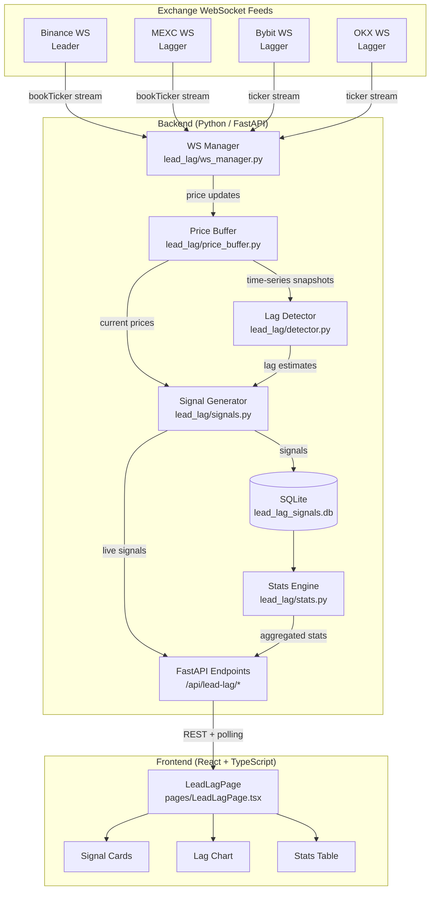
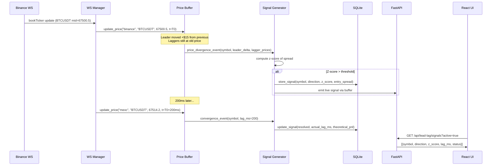
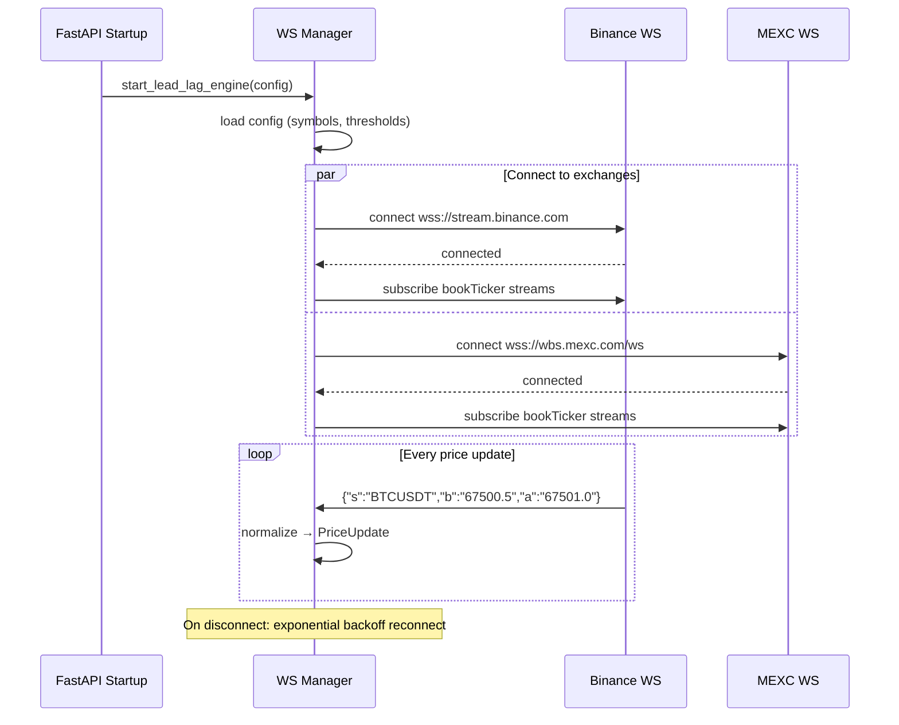

# Design Document: Lead-Lag Arbitrage

## Overview

Lead-Lag Arbitrage exploits the time delay between price updates across trading venues. When the same asset trades on multiple exchanges, prices don't update in perfect synchrony — a price move on the "leading" exchange (typically Binance, the most liquid) is followed by the same move on "lagging" exchanges (MEXC, Bybit, etc.) with a delay of milliseconds to seconds.

This module adds a **monitoring and analysis layer** to the MEXC Spread Monitor that: (1) collects real-time order book data from multiple exchanges via WebSocket, (2) dynamically detects lead-lag relationships, (3) generates signals when the leader moves and the lagger hasn't caught up, (4) displays opportunities in a dedicated `/lead-lag` dashboard page, and (5) records historical signal data for backtesting and statistics.

This is an **analysis-only** module — no auto-trading. It provides visibility into cross-exchange price dynamics and quantifies theoretical arbitrage opportunities.

## Architecture

The system extends the existing architecture with a new `lead_lag` subpackage in `mexc_monitor/` and a new frontend page. It reuses the existing WebSocket infrastructure patterns (from `ws_futures.py`) and exchange client patterns (from `mexc_monitor/binance/client.py`).



## Sequence Diagrams

### Main Flow: Signal Detection



### WebSocket Connection Lifecycle



## Components and Interfaces

### Component 1: WS Manager (`mexc_monitor/lead_lag/ws_manager.py`)

**Purpose**: Manages WebSocket connections to multiple exchanges, normalizes incoming price data into a unified format, and feeds the Price Buffer.

**Interface**:
```python
class LeadLagWSManager:
    def __init__(self, config: LeadLagConfig) -> None: ...
    def start(self) -> None: ...
    def stop(self) -> None: ...
    def is_running(self) -> bool: ...
    def connection_status(self) -> dict[str, ConnectionStatus]: ...
```

**Responsibilities**:
- Maintain persistent WebSocket connections to configured exchanges
- Handle reconnection with exponential backoff (reusing pattern from `ws_futures.py`)
- Normalize exchange-specific message formats into `PriceUpdate` objects
- Route updates to the Price Buffer
- Report connection health per exchange

---

### Component 2: Price Buffer (`mexc_monitor/lead_lag/price_buffer.py`)

**Purpose**: Thread-safe circular buffer storing recent price updates per symbol per exchange. Provides time-series access for lag detection and current-price access for signal generation.

**Interface**:
```python
class PriceBuffer:
    def __init__(self, max_history_sec: float = 60.0) -> None: ...
    def update(self, exchange: str, symbol: str, mid: float, timestamp_ms: int) -> None: ...
    def get_latest(self, exchange: str, symbol: str) -> PriceSnapshot | None: ...
    def get_all_latest(self, symbol: str) -> dict[str, PriceSnapshot]: ...
    def get_history(self, exchange: str, symbol: str, last_n_sec: float) -> list[PriceSnapshot]: ...
    def get_spread(self, symbol: str, leader: str, lagger: str) -> SpreadSnapshot | None: ...
```

**Responsibilities**:
- Store last N seconds of price data per exchange per symbol (ring buffer)
- Provide O(1) access to latest price per exchange
- Provide time-windowed history for lag correlation
- Thread-safe (multiple WS threads write, detector/signal threads read)
- Auto-evict stale data beyond `max_history_sec`

---

### Component 3: Lag Detector (`mexc_monitor/lead_lag/detector.py`)

**Purpose**: Estimates the lead-lag delay between exchanges using cross-correlation of price time series. Dynamically identifies which exchange leads for each symbol.

**Interface**:
```python
class LagDetector:
    def __init__(self, config: LeadLagConfig) -> None: ...
    def update_estimate(self, symbol: str, price_buffer: PriceBuffer) -> LagEstimate: ...
    def get_estimate(self, symbol: str) -> LagEstimate | None: ...
    def get_leader(self, symbol: str) -> str | None: ...
    def get_all_estimates(self) -> dict[str, LagEstimate]: ...
```

**Responsibilities**:
- Compute cross-correlation between leader and lagger price series
- Estimate lag in milliseconds per symbol per exchange pair
- Detect leader/lagger roles dynamically (not hardcoded to Binance)
- Update estimates periodically (every N seconds)
- Expose confidence score for each estimate

---

### Component 4: Signal Generator (`mexc_monitor/lead_lag/signals.py`)

**Purpose**: Generates trading signals when the leader moves significantly and the lagger hasn't caught up. Tracks signal lifecycle (open → resolved/expired).

**Interface**:
```python
class SignalGenerator:
    def __init__(self, config: LeadLagConfig, price_buffer: PriceBuffer, lag_detector: LagDetector) -> None: ...
    def tick(self) -> list[LeadLagSignal]: ...
    def get_active_signals(self) -> list[LeadLagSignal]: ...
    def get_recent_signals(self, limit: int = 50) -> list[LeadLagSignal]: ...
```

**Responsibilities**:
- Monitor price divergence between leader and lagger
- Compute z-score of the spread (normalized by rolling std dev)
- Generate signal when z-score exceeds configured threshold
- Track signal resolution (lagger catches up) or expiry (timeout)
- Calculate theoretical PnL for each resolved signal
- Persist signals to SQLite via the store

---

### Component 5: Signal Store (`mexc_monitor/lead_lag/store.py`)

**Purpose**: Persists signals and statistics to SQLite for historical analysis and backtesting.

**Interface**:
```python
class LeadLagStore:
    def __init__(self, db_path: str) -> None: ...
    def save_signal(self, signal: LeadLagSignal) -> None: ...
    def update_signal(self, signal_id: str, resolution: SignalResolution) -> None: ...
    def query_signals(self, filters: SignalQuery) -> list[LeadLagSignal]: ...
    def get_stats(self, window_hours: int = 24) -> LeadLagStats: ...
```

**Responsibilities**:
- Create/migrate SQLite schema for signals table
- Insert new signals, update resolved signals
- Query with filters (symbol, time range, status, direction)
- Compute aggregate statistics (win rate, avg lag, avg PnL, signal frequency)

---

### Component 6: Stats Engine (`mexc_monitor/lead_lag/stats.py`)

**Purpose**: Computes aggregate statistics from historical signals for dashboard display.

**Interface**:
```python
class StatsEngine:
    def __init__(self, store: LeadLagStore) -> None: ...
    def summary(self, window_hours: int = 24) -> LeadLagStats: ...
    def per_symbol_stats(self, window_hours: int = 24) -> list[SymbolStats]: ...
    def lag_distribution(self, symbol: str | None = None) -> LagDistribution: ...
```

**Responsibilities**:
- Aggregate signal outcomes over configurable time windows
- Compute: average lag time, signal frequency, theoretical PnL, win rate
- Per-symbol breakdown of performance
- Lag time distribution for visualization

---

### Component 7: FastAPI Endpoints (`backend/main.py` additions)

**Purpose**: Expose lead-lag data to the frontend via REST API.

**Interface**:
```python
# New endpoints added to backend/main.py

@app.get("/api/lead-lag/status")
def lead_lag_status() -> dict: ...

@app.get("/api/lead-lag/signals")
def lead_lag_signals(active: bool = False, symbol: str | None = None, limit: int = 50) -> list[dict]: ...

@app.get("/api/lead-lag/stats")
def lead_lag_stats(window_hours: int = 24) -> dict: ...

@app.get("/api/lead-lag/prices")
def lead_lag_prices(symbol: str) -> dict: ...

@app.get("/api/lead-lag/lag-estimates")
def lead_lag_estimates() -> list[dict]: ...

@app.post("/api/lead-lag/start")
def lead_lag_start() -> dict: ...

@app.post("/api/lead-lag/stop")
def lead_lag_stop() -> dict: ...
```

**Responsibilities**:
- Serve current engine status (running, connections, symbols)
- Serve active and historical signals
- Serve aggregated statistics
- Serve real-time prices for selected symbol (all exchanges)
- Start/stop the lead-lag engine
- Serve lag estimates per symbol

---

### Component 8: Frontend Page (`frontend/src/pages/LeadLagPage.tsx`)

**Purpose**: Dashboard page at `/lead-lag` displaying real-time lead-lag analysis.

**Interface** (React component):
```typescript
export function LeadLagPage(): JSX.Element;

// Sub-components
function SignalFeed(props: { signals: LeadLagSignal[] }): JSX.Element;
function LagHeatmap(props: { estimates: LagEstimate[] }): JSX.Element;
function StatsPanel(props: { stats: LeadLagStats }): JSX.Element;
function PriceComparisonChart(props: { symbol: string; prices: ExchangePrices }): JSX.Element;
function ConnectionStatus(props: { status: Record<string, ConnectionInfo> }): JSX.Element;
```

**Responsibilities**:
- Display live signal feed (active opportunities)
- Show lag heatmap (exchange × symbol matrix with lag in ms)
- Show statistics panel (win rate, avg lag, theoretical PnL, signal count)
- Price comparison chart for selected symbol across exchanges
- Connection status indicators per exchange
- Auto-refresh via polling (2-5 second interval)

## Data Models

### Core Data Models (Python)

```python
from dataclasses import dataclass, field
from enum import Enum
from typing import Optional
import time


class SignalDirection(str, Enum):
    LONG = "long"   # Leader moved up, lagger should follow
    SHORT = "short" # Leader moved down, lagger should follow


class SignalStatus(str, Enum):
    ACTIVE = "active"       # Signal open, waiting for convergence
    RESOLVED = "resolved"   # Lagger caught up
    EXPIRED = "expired"     # Timeout without convergence


@dataclass(frozen=True)
class PriceSnapshot:
    """Single price observation from one exchange."""
    exchange: str
    symbol: str
    bid: float
    ask: float
    mid: float
    timestamp_ms: int  # Unix milliseconds


@dataclass(frozen=True)
class SpreadSnapshot:
    """Price difference between leader and lagger at a point in time."""
    symbol: str
    leader_exchange: str
    lagger_exchange: str
    leader_mid: float
    lagger_mid: float
    spread_abs: float       # leader_mid - lagger_mid
    spread_bps: float       # 10000 * spread_abs / leader_mid
    timestamp_ms: int


@dataclass(frozen=True)
class LagEstimate:
    """Estimated lag between two exchanges for a symbol."""
    symbol: str
    leader_exchange: str
    lagger_exchange: str
    lag_ms: float           # Estimated delay in milliseconds
    correlation: float      # Cross-correlation coefficient (0-1)
    confidence: float       # Confidence in estimate (0-1)
    sample_count: int       # Number of observations used
    updated_at: str         # ISO8601


@dataclass
class LeadLagSignal:
    """A detected lead-lag arbitrage opportunity."""
    id: str                         # UUID
    symbol: str
    leader_exchange: str
    lagger_exchange: str
    direction: SignalDirection
    z_score: float                  # Normalized spread at signal time
    entry_spread_bps: float         # Spread in bps when signal generated
    leader_mid_at_signal: float     # Leader price when signal fired
    lagger_mid_at_signal: float     # Lagger price when signal fired
    estimated_lag_ms: float         # Expected convergence time
    status: SignalStatus = SignalStatus.ACTIVE
    created_at: str = ""            # ISO8601
    resolved_at: Optional[str] = None
    actual_lag_ms: Optional[float] = None
    exit_spread_bps: Optional[float] = None
    theoretical_pnl_bps: Optional[float] = None  # entry_spread - exit_spread - fees


@dataclass(frozen=True)
class LeadLagStats:
    """Aggregate statistics over a time window."""
    window_hours: int
    total_signals: int
    resolved_signals: int
    expired_signals: int
    win_rate: float                 # % of resolved signals with positive PnL
    avg_lag_ms: float
    median_lag_ms: float
    avg_theoretical_pnl_bps: float
    total_theoretical_pnl_bps: float
    signals_per_hour: float
    top_symbols: list[str]          # Most active symbols


@dataclass(frozen=True)
class LeadLagConfig:
    """Configuration for the lead-lag engine."""
    enabled: bool = False
    leader_exchange: str = "binance"
    lagger_exchanges: list[str] = field(default_factory=lambda: ["mexc"])
    symbols: list[str] = field(default_factory=lambda: ["BTCUSDT", "ETHUSDT"])
    market: str = "futures"                     # "spot" or "futures"
    z_score_entry_threshold: float = 2.0        # Signal when z > N
    z_score_exit_threshold: float = 0.5         # Resolve when z < N
    signal_timeout_sec: float = 10.0            # Expire signal after N sec
    rolling_window_sec: float = 300.0           # Window for std dev calculation
    min_spread_bps: float = 3.0                 # Minimum spread to generate signal
    lag_estimation_interval_sec: float = 30.0   # How often to re-estimate lag
    price_buffer_history_sec: float = 60.0      # How much price history to keep
    db_path: str = "data/lead_lag_signals.sqlite"
    assumed_taker_fee_bps: float = 2.0          # Per side, for theoretical PnL
```

**Validation Rules**:
- `z_score_entry_threshold` must be > `z_score_exit_threshold`
- `z_score_entry_threshold` must be > 0
- `signal_timeout_sec` must be > 0
- `symbols` must be non-empty
- `lagger_exchanges` must be non-empty
- `leader_exchange` must not be in `lagger_exchanges`
- `assumed_taker_fee_bps` must be >= 0

---

### Frontend TypeScript Types

```typescript
interface PriceSnapshot {
  exchange: string;
  symbol: string;
  bid: number;
  ask: number;
  mid: number;
  timestamp_ms: number;
}

interface LagEstimate {
  symbol: string;
  leader_exchange: string;
  lagger_exchange: string;
  lag_ms: number;
  correlation: number;
  confidence: number;
  sample_count: number;
  updated_at: string;
}

type SignalDirection = "long" | "short";
type SignalStatus = "active" | "resolved" | "expired";

interface LeadLagSignal {
  id: string;
  symbol: string;
  leader_exchange: string;
  lagger_exchange: string;
  direction: SignalDirection;
  z_score: number;
  entry_spread_bps: number;
  leader_mid_at_signal: number;
  lagger_mid_at_signal: number;
  estimated_lag_ms: number;
  status: SignalStatus;
  created_at: string;
  resolved_at: string | null;
  actual_lag_ms: number | null;
  exit_spread_bps: number | null;
  theoretical_pnl_bps: number | null;
}

interface LeadLagStats {
  window_hours: number;
  total_signals: number;
  resolved_signals: number;
  expired_signals: number;
  win_rate: number;
  avg_lag_ms: number;
  median_lag_ms: number;
  avg_theoretical_pnl_bps: number;
  total_theoretical_pnl_bps: number;
  signals_per_hour: number;
  top_symbols: string[];
}

interface LeadLagStatus {
  running: boolean;
  connections: Record<string, { connected: boolean; last_message_ms: number }>;
  symbols_monitored: string[];
  active_signals_count: number;
  uptime_sec: number;
}

interface LeadLagConfig {
  enabled: boolean;
  leader_exchange: string;
  lagger_exchanges: string[];
  symbols: string[];
  market: "spot" | "futures";
  z_score_entry_threshold: number;
  z_score_exit_threshold: number;
  signal_timeout_sec: number;
  rolling_window_sec: number;
  min_spread_bps: number;
}
```

---

### SQLite Schema

```sql
CREATE TABLE IF NOT EXISTS lead_lag_signals (
    id TEXT PRIMARY KEY,
    symbol TEXT NOT NULL,
    leader_exchange TEXT NOT NULL,
    lagger_exchange TEXT NOT NULL,
    direction TEXT NOT NULL CHECK (direction IN ('long', 'short')),
    z_score REAL NOT NULL,
    entry_spread_bps REAL NOT NULL,
    leader_mid_at_signal REAL NOT NULL,
    lagger_mid_at_signal REAL NOT NULL,
    estimated_lag_ms REAL NOT NULL,
    status TEXT NOT NULL DEFAULT 'active' CHECK (status IN ('active', 'resolved', 'expired')),
    created_at TEXT NOT NULL,
    resolved_at TEXT,
    actual_lag_ms REAL,
    exit_spread_bps REAL,
    theoretical_pnl_bps REAL,
    
    -- Indexes for common queries
    INDEX idx_signals_status (status),
    INDEX idx_signals_symbol (symbol),
    INDEX idx_signals_created (created_at DESC)
);

CREATE TABLE IF NOT EXISTS lead_lag_lag_estimates (
    id INTEGER PRIMARY KEY AUTOINCREMENT,
    symbol TEXT NOT NULL,
    leader_exchange TEXT NOT NULL,
    lagger_exchange TEXT NOT NULL,
    lag_ms REAL NOT NULL,
    correlation REAL NOT NULL,
    confidence REAL NOT NULL,
    sample_count INTEGER NOT NULL,
    recorded_at TEXT NOT NULL,
    
    INDEX idx_estimates_symbol (symbol, recorded_at DESC)
);
```

## Error Handling

### Error Scenario 1: WebSocket Disconnection

**Condition**: Exchange WebSocket connection drops (network issue, exchange maintenance, rate limit)
**Response**: Log warning, mark exchange as disconnected in status, pause signal generation for affected pairs
**Recovery**: Exponential backoff reconnection (1s → 2s → 4s → ... → 60s max), resume signal generation once reconnected and price buffer refills

### Error Scenario 2: Stale Price Data

**Condition**: No price update from an exchange for > `stale_after_sec` (default 5s)
**Response**: Mark exchange prices as stale, exclude from signal generation, show warning in UI
**Recovery**: Automatic and immediate once any valid message arrives; stale flag cleared instantly on next valid update (no additional conditions required)

### Error Scenario 3: All Laggers Disconnected

**Condition**: No lagger exchanges have active connections
**Response**: Pause signal generation immediately (do not continue using only Binance data), set engine status to "degraded", log error
**Recovery**: Resume when at least one lagger reconnects and accumulates 5+ seconds of data

### Error Scenario 4: Leader Disconnected

**Condition**: The leader exchange (Binance) loses connection
**Response**: Pause all signal generation (no reference price), set engine status to "no_leader"
**Recovery**: Resume on reconnection; optionally fall back to next-most-liquid exchange if configured

### Error Scenario 5: Database Write Failure

**Condition**: SQLite write fails (disk full, corruption)
**Response**: Log error, continue signal generation in memory (don't crash the engine), retry writes every 30 seconds
**Recovery**: Signals buffered in memory (up to 1000, FIFO eviction when full) until DB is available again. Engine status returns to "running" when connection recovers regardless of DB issues.

## Testing Strategy

### Unit Testing Approach

- **Price Buffer**: Test thread safety, eviction of old data, correct time-windowed queries
- **Lag Detector**: Test cross-correlation with synthetic data (known lag), edge cases (no data, single point)
- **Signal Generator**: Test z-score computation, threshold crossing, signal lifecycle (active → resolved/expired)
- **Store**: Test CRUD operations, query filters, stats aggregation

### Property-Based Testing Approach

**Property Test Library**: hypothesis (Python)

- **Price Buffer invariant**: Buffer size never exceeds `max_history_sec` worth of data
- **Signal lifecycle**: Every signal transitions from ACTIVE to exactly one of {RESOLVED, EXPIRED}
- **Z-score symmetry**: If leader moves up by X bps, z-score magnitude equals that of leader moving down by X bps
- **Stats consistency**: `total_signals == resolved_signals + expired_signals + active_signals`
- **Lag estimate bounds**: Estimated lag is always >= 0 and <= `price_buffer_history_sec * 1000`

### Integration Testing Approach

- End-to-end test with mock WebSocket servers simulating exchange feeds
- Test signal generation with known price sequences (deterministic lag)
- Test API endpoints return correct data shapes
- Test frontend components render with mock API responses

## Performance Considerations

- **Price Buffer**: Ring buffer with O(1) insert, O(1) latest lookup. Memory bounded by `symbols × exchanges × buffer_size`
- **WebSocket throughput**: Binance bookTicker sends ~10-50 messages/sec per symbol. For 20 symbols across 4 exchanges: ~800-4000 msg/sec total. Python threading with GIL is sufficient for this rate.
- **Z-score computation**: Rolling mean/std over fixed window — O(1) amortized with incremental updates
- **SQLite writes**: Batch inserts every 1-2 seconds rather than per-signal to reduce I/O
- **Frontend polling**: 2-5 second interval for signals, 10 second for stats. No WebSocket to frontend (keeps it simple, matches existing patterns)
- **Memory**: ~50 bytes per price point × 60 sec × 20 symbols × 4 exchanges ≈ 240KB for price buffer

## Security Considerations

- All exchange connections use public APIs only (no authentication required)
- No private keys or API secrets needed for this module
- WebSocket connections use WSS (TLS encrypted)
- SQLite database stored locally, no network exposure
- API endpoints follow existing CORS policy (localhost only in dev)
- No user input is passed directly to SQL queries (parameterized via SQLAlchemy)

## Dependencies

### Python (Backend)
| Package | Purpose | Status |
|---------|---------|--------|
| `websocket-client` | WebSocket connections to exchanges | Already installed |
| `httpx` | HTTP fallback for initial data | Already installed |
| `sqlalchemy` | SQLite ORM for signal persistence | Already installed |
| `numpy` | Cross-correlation for lag detection | New dependency |

### JavaScript (Frontend)
| Package | Purpose | Status |
|---------|---------|--------|
| `react-router-dom` | Page routing (`/lead-lag`) | Already installed |
| `lucide-react` | Icons for status indicators | Already installed |
| `lightweight-charts` | Price comparison chart | Already installed |

### Configuration Extension

New section in `config/external_apis.json`:
```json
{
  "lead_lag": {
    "enabled": false,
    "leader_exchange": "binance",
    "lagger_exchanges": ["mexc"],
    "symbols": ["BTCUSDT", "ETHUSDT", "SOLUSDT"],
    "market": "futures",
    "z_score_entry_threshold": 2.0,
    "z_score_exit_threshold": 0.5,
    "signal_timeout_sec": 10.0,
    "rolling_window_sec": 300.0,
    "min_spread_bps": 3.0,
    "lag_estimation_interval_sec": 30.0,
    "price_buffer_history_sec": 60.0,
    "db_path": "data/lead_lag_signals.sqlite",
    "assumed_taker_fee_bps": 2.0,
    "ws_urls": {
      "binance_futures": "wss://fstream.binance.com/ws",
      "binance_spot": "wss://stream.binance.com:9443/ws",
      "mexc_futures": "wss://contract.mexc.com/edge",
      "mexc_spot": "wss://wbs.mexc.com/ws",
      "bybit": "wss://stream.bybit.com/v5/public/linear",
      "okx": "wss://ws.okx.com:8443/ws/v5/public"
    }
  }
}
```

## Correctness Properties

*A property is a characteristic or behavior that should hold true across all valid executions of a system-essentially, a formal statement about what the system should do. Properties serve as the bridge between human-readable specifications and machine-verifiable correctness guarantees.*

### Property 1: Price Buffer Boundedness

*For any* sequence of price updates inserted into the Price Buffer, the buffer never stores data older than `max_history_sec`. For any query `get_history(exchange, symbol, last_n_sec)`, all returned snapshots have `timestamp_ms >= now_ms - last_n_sec * 1000`.

**Validates: Requirements 2.2, 2.4**

### Property 2: Spread Computation Accuracy

*For any* pair of leader_mid and lagger_mid prices (both > 0), the computed spread_bps equals exactly `10000 * (leader_mid - lagger_mid) / leader_mid`, and a signal's `entry_spread_bps` at creation time equals this formula applied to the leader and lagger mid-prices at that instant.

**Validates: Requirements 2.6, 4.2**

### Property 3: Lag Detection Correctness

*For any* pair of synthetic price time series where one series leads the other by a known delay D milliseconds, the Lag Detector SHALL identify the correct leader exchange and estimate a lag within acceptable tolerance of D.

**Validates: Requirements 3.1, 3.3**

### Property 4: Lag Estimate Bounds

*For any* lag estimate produced by the Lag Detector, the value is >= 0 milliseconds and <= `price_buffer_history_sec * 1000` milliseconds.

**Validates: Requirement 3.5**

### Property 5: Signal Generation Threshold

*For any* price state, a new LeadLagSignal is created if and only if the z-score of the spread exceeds `z_score_entry_threshold` AND the absolute spread exceeds `min_spread_bps` AND no ACTIVE signal already exists for that (symbol, lagger_exchange) pair.

**Validates: Requirements 4.1, 4.5**

### Property 6: No Duplicate Active Signals

*For any* sequence of price events for a given (symbol, lagger_exchange) pair, at most one signal with status ACTIVE exists at any point in time. A new signal can only be created after the previous one transitions to RESOLVED or EXPIRED.

**Validates: Requirement 4.5**

### Property 7: Signal Lifecycle Completeness

*For any* LeadLagSignal, it eventually transitions from ACTIVE to exactly one of RESOLVED (when z-score drops below `z_score_exit_threshold`) or EXPIRED (when time exceeds `signal_timeout_sec`). No signal remains ACTIVE beyond `signal_timeout_sec` seconds.

**Validates: Requirements 4.3, 4.4**

### Property 8: Theoretical PnL Correctness

*For any* resolved or expired signal with known entry_spread_bps, exit_spread_bps, and assumed_taker_fee_bps, the theoretical_pnl_bps equals exactly `entry_spread_bps - exit_spread_bps - 2 * assumed_taker_fee_bps`.

**Validates: Requirement 4.6**

### Property 9: Signal Store Round-Trip

*For any* valid LeadLagSignal object, saving it to the Signal Store and then querying it back by ID SHALL produce an equivalent object with all fields preserved.

**Validates: Requirement 5.1**

### Property 10: Signal Store Filter Correctness

*For any* set of stored signals and any valid filter combination (symbol, time range, status, direction), all returned signals match the filter criteria and no matching signals are omitted.

**Validates: Requirement 5.3**

### Property 11: Stats Consistency

*For any* set of signals in the database, the Stats Engine SHALL produce statistics where `total_signals == resolved_signals + expired_signals + active_signals`, and per-symbol signal counts sum to the total signal count.

**Validates: Requirements 6.1, 6.2, 6.3**

### Property 12: Config Validation Correctness

*For any* LeadLagConfig object, validation accepts it if and only if: z_score_entry_threshold > z_score_exit_threshold, z_score_entry_threshold > 0, signal_timeout_sec > 0, symbols is non-empty, lagger_exchanges is non-empty, leader_exchange is not in lagger_exchanges, and assumed_taker_fee_bps >= 0.

**Validates: Requirement 9.2**

### Property 13: Message Normalization Completeness

*For any* valid exchange-specific WebSocket message (Binance bookTicker, MEXC bookTicker, Bybit ticker, OKX ticker), the WS Manager produces a valid PriceSnapshot with all required fields (exchange, symbol, bid > 0, ask > 0, mid = (bid+ask)/2, timestamp_ms > 0).

**Validates: Requirement 1.2**
