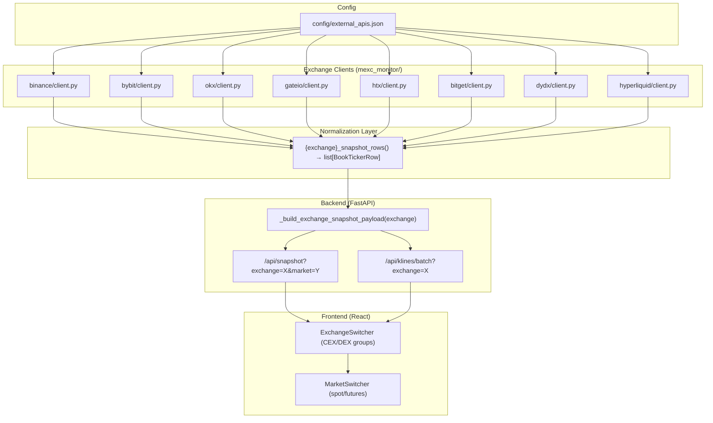

# Design Document: Multi-Exchange Integration

## Overview

Расширение MEXC Spread Monitor восемью новыми биржами (Binance, Bybit, OKX, Gate.io, HTX, Bitget, dYdX, Hyperliquid) по существующему паттерну: Python-клиент с httpx → нормализация в BookTickerRow → конфигурация в external_apis.json → поддержка в FastAPI-эндпоинтах → отображение в ExchangeSwitcher UI.

Каждый новый клиент повторяет архитектуру AsterDEX/Lighter:
- Модуль `mexc_monitor/{exchange_name}/client.py` с классом `PublicClient`
- Dataclass-ы для сырых ответов API
- Функция `{exchange}_snapshot_rows()` для нормализации в `BookTickerRow`
- Секция в `config/external_apis.json` с base_url, timeout_sec, endpoints
- Регистрация в `_SUPPORTED_EXCHANGES` и `_build_dex_snapshot_payload` в backend/main.py

## Architecture



### Design Decisions

1. **Единый паттерн клиента**: Все новые клиенты следуют паттерну AsterPublicClient — класс с `_get()` helper, dataclass-ы для raw responses, кастомный `{Exchange}ApiError`.
2. **Расширение `_build_dex_snapshot_payload`**: Вместо создания отдельной функции для каждой биржи, расширяем существующий dispatch-механизм в единую функцию `_build_exchange_snapshot_payload` с маппингом exchange → snapshot_rows function.
3. **Конфигурация через JSON**: Все параметры подключения в `config/external_apis.json` — без изменения кода при смене URL/timeout.
4. **Группировка в UI**: ExchangeSwitcher разделяет CEX и DEX визуально, с компактным layout для 11 бирж.
5. **Market switcher**: Для бирж с несколькими рынками (Binance, OKX, Gate.io, HTX) показывается переключатель spot/futures; для остальных — скрыт.

## Components and Interfaces

### Exchange Client Interface (Python)

Каждый клиент реализует одинаковый контракт:

```python
# mexc_monitor/{exchange}/client.py

class {Exchange}ApiError(RuntimeError):
    """Ошибка при обращении к {Exchange} API."""
    pass

class {Exchange}PublicClient:
    def __init__(self, base_url: str | None = None, timeout_sec: float | None = None):
        # Загрузка конфигурации из external_apis.json
        ...

    def _get(self, path: str, params: dict | None = None) -> Any:
        # HTTP GET с обработкой ошибок, rate limit, timeout
        ...

    def _post(self, path: str, body: dict | None = None) -> Any:
        # HTTP POST (для Hyperliquid)
        ...

    def book_tickers(self, market: str = "futures") -> list[{Exchange}BookTicker]:
        # Получение тикеров
        ...

    def klines(self, symbol: str, interval: str = "1h", limit: int = 96) -> list[dict]:
        # Получение свечей в формате {time, open, high, low, close, volume}
        ...

def {exchange}_snapshot_rows(client: {Exchange}PublicClient | None = None) -> list[BookTickerRow]:
    # Нормализация в BookTickerRow
    ...
```

### Module Structure

```
mexc_monitor/
├── binance/
│   ├── __init__.py          # from .client import BinancePublicClient, binance_snapshot_rows
│   └── client.py            # BinancePublicClient, BinanceApiError, BinanceBookTicker
├── bybit/
│   ├── __init__.py
│   └── client.py            # BybitPublicClient, BybitApiError
├── okx/
│   ├── __init__.py
│   └── client.py            # OkxPublicClient, OkxApiError
├── gateio/
│   ├── __init__.py
│   └── client.py            # GateioPublicClient, GateioApiError
├── htx/
│   ├── __init__.py
│   └── client.py            # HtxPublicClient, HtxApiError
├── bitget/
│   ├── __init__.py
│   └── client.py            # BitgetPublicClient, BitgetApiError
├── dydx/
│   ├── __init__.py
│   └── client.py            # DydxPublicClient, DydxApiError
└── hyperliquid/
    ├── __init__.py
    └── client.py            # HyperliquidPublicClient, HyperliquidApiError
```

### Backend Dispatch (backend/main.py)

```python
# Расширенный список поддерживаемых бирж
_SUPPORTED_EXCHANGES = [
    "mexc", "asterdex", "lighter",
    "binance", "bybit", "okx", "gateio", "htx", "bitget", "dydx", "hyperliquid",
]

# Маппинг exchange → (snapshot_rows_function, default_market)
_EXCHANGE_SNAPSHOT_MAP: dict[str, tuple[Callable, str]] = {
    "asterdex": (aster_snapshot_rows, "perp"),
    "lighter": (lighter_snapshot_rows, "perp"),
    "binance": (binance_snapshot_rows, "futures"),
    "bybit": (bybit_snapshot_rows, "perp"),
    "okx": (okx_snapshot_rows, "futures"),
    "gateio": (gateio_snapshot_rows, "futures"),
    "htx": (htx_snapshot_rows, "futures"),
    "bitget": (bitget_snapshot_rows, "perp"),
    "dydx": (dydx_snapshot_rows, "perp"),
    "hyperliquid": (hyperliquid_snapshot_rows, "perp"),
}

# Биржи с поддержкой нескольких рынков
_MULTI_MARKET_EXCHANGES = {"binance", "okx", "gateio", "htx"}
```

### Frontend Components

```typescript
// types.ts — расширенный тип Exchange
type Exchange =
  | "mexc" | "asterdex" | "lighter"
  | "binance" | "bybit" | "okx" | "gateio" | "htx" | "bitget"
  | "dydx" | "hyperliquid";

// ExchangeSwitcher.tsx — группировка CEX/DEX
interface ExchangeGroup {
  label: string;           // "CEX" | "DEX"
  exchanges: { value: Exchange; label: string }[];
}

const EXCHANGE_GROUPS: ExchangeGroup[] = [
  {
    label: "CEX",
    exchanges: [
      { value: "mexc", label: "MEXC" },
      { value: "binance", label: "Binance" },
      { value: "bybit", label: "Bybit" },
      { value: "okx", label: "OKX" },
      { value: "gateio", label: "Gate.io" },
      { value: "htx", label: "HTX" },
      { value: "bitget", label: "Bitget" },
    ],
  },
  {
    label: "DEX",
    exchanges: [
      { value: "asterdex", label: "AsterDEX" },
      { value: "lighter", label: "Lighter" },
      { value: "dydx", label: "dYdX" },
      { value: "hyperliquid", label: "Hyperliquid" },
    ],
  },
];

// Биржи с переключателем рынков
const MULTI_MARKET_EXCHANGES: Exchange[] = ["mexc", "binance", "okx", "gateio", "htx"];
```

### Symbol Normalization Rules

| Биржа | Исходный формат | Нормализованный |
|-------|----------------|-----------------|
| Binance | `BTCUSDT` | `BTCUSDT` |
| Bybit | `BTCUSDT` | `BTCUSDT` |
| OKX | `BTC-USDT`, `BTC-USDT-SWAP` | `BTCUSDT` |
| Gate.io | `BTC_USDT` | `BTCUSDT` |
| HTX | `btcusdt` | `BTCUSDT` |
| Bitget | `BTCUSDT` (+ суффикс контракта) | `BTCUSDT` |
| dYdX | `BTC-USD` | `BTCUSD` |
| Hyperliquid | `BTC` | `BTCUSDT` |

### Klines Interval Mapping

| Стандартный | Binance | Bybit | OKX | Gate.io | HTX | Bitget | dYdX | Hyperliquid |
|-------------|---------|-------|-----|---------|-----|--------|------|-------------|
| `5m` | `5m` | `5` | `5m` | `5m` | `5min` | `5m` | `5MINS` | `5m` |
| `15m` | `15m` | `15` | `15m` | `15m` | `15min` | `15m` | `15MINS` | `15m` |
| `1h` | `1h` | `60` | `1H` | `1h` | `60min` | `1h` | `1HOUR` | `1h` |
| `4h` | `4h` | `240` | `4H` | `4h` | `4hour` | `4h` | `4HOURS` | `4h` |
| `1d` | `1d` | `D` | `1D` | `1d` | `1day` | `1d` | `1DAY` | `1d` |

## Data Models

### Raw API Response Dataclasses (per exchange)

Каждый клиент определяет frozen dataclass для сырых ответов:

```python
@dataclass(frozen=True)
class {Exchange}BookTicker:
    symbol: str
    bid_price: float
    bid_qty: float
    ask_price: float
    ask_qty: float
    volume_24h_base: float = 0.0
    volume_24h_quote: float = 0.0
    funding_rate: float | None = None
```

### BookTickerRow (existing, unchanged)

```python
@dataclass(frozen=True)
class BookTickerRow:
    symbol: str
    bid: float
    ask: float
    bid_qty: float
    ask_qty: float
    mid: float
    spread_abs: float
    spread_bps: float | None
    volume_24h_base: float
    volume_24h_quote: float
    funding_rate: float | None = None
    observed_at: str | None = None
    fee_round_trip_bps: float = 0.0
    net_spread_bps: float | None = None
    l1_max_executable_base: float = 0.0
    l1_max_notional_quote: float = 0.0
    reference_quote_notional: float | None = None
    l1_covers_reference_notional: bool | None = None
```

### Configuration Schema (config/external_apis.json)

Новые секции для каждой биржи:

```json
{
  "binance": {
    "spot_base_url": "https://api.binance.com",
    "futures_base_url": "https://fapi.binance.com",
    "timeout_sec": 15,
    "endpoints": {
      "spot_book_ticker": "/api/v3/ticker/bookTicker",
      "futures_book_ticker": "/fapi/v1/ticker/bookTicker",
      "spot_ticker_24hr": "/api/v3/ticker/24hr",
      "futures_ticker_24hr": "/fapi/v1/ticker/24hr",
      "spot_klines": "/api/v3/klines",
      "futures_klines": "/fapi/v1/klines"
    }
  },
  "bybit": {
    "base_url": "https://api.bybit.com",
    "timeout_sec": 15,
    "endpoints": {
      "tickers": "/v5/market/tickers",
      "klines": "/v5/market/kline"
    }
  },
  "okx": {
    "base_url": "https://www.okx.com",
    "timeout_sec": 15,
    "endpoints": {
      "tickers": "/api/v5/market/tickers",
      "candles": "/api/v5/market/candles"
    }
  },
  "gateio": {
    "spot_base_url": "https://api.gateio.ws",
    "futures_base_url": "https://api.gateio.ws",
    "timeout_sec": 15,
    "endpoints": {
      "spot_tickers": "/api/v4/spot/tickers",
      "futures_tickers": "/api/v4/futures/usdt/tickers",
      "spot_klines": "/api/v4/spot/candlesticks",
      "futures_klines": "/api/v4/futures/usdt/candlesticks"
    }
  },
  "htx": {
    "spot_base_url": "https://api.huobi.pro",
    "futures_base_url": "https://api.hbdm.com",
    "timeout_sec": 15,
    "endpoints": {
      "spot_tickers": "/market/tickers",
      "futures_tickers": "/linear-swap-ex/market/detail/batch_merged",
      "spot_klines": "/market/history/kline",
      "futures_klines": "/linear-swap-ex/market/history/kline"
    }
  },
  "bitget": {
    "base_url": "https://api.bitget.com",
    "timeout_sec": 15,
    "endpoints": {
      "tickers": "/api/v2/mix/market/tickers",
      "klines": "/api/v2/mix/market/candles"
    }
  },
  "dydx": {
    "base_url": "https://indexer.dydx.trade",
    "timeout_sec": 15,
    "endpoints": {
      "perpetual_markets": "/v4/perpetualMarkets",
      "orderbook": "/v4/orderbooks/perpetualMarket/{market}",
      "candles": "/v4/candles/perpetualMarkets/{market}"
    }
  },
  "hyperliquid": {
    "base_url": "https://api.hyperliquid.xyz",
    "timeout_sec": 15,
    "endpoints": {
      "info": "/info"
    }
  }
}
```


## Correctness Properties

*A property is a characteristic or behavior that should hold true across all valid executions of a system — essentially, a formal statement about what the system should do. Properties serve as the bridge between human-readable specifications and machine-verifiable correctness guarantees.*

### Property 1: Normalization produces valid BookTickerRow

*For any* valid raw ticker response from any supported exchange (Binance, Bybit, OKX, Gate.io, HTX, Bitget, dYdX, Hyperliquid), the normalization function SHALL produce a BookTickerRow with all required fields populated: symbol (non-empty string), bid > 0, ask > 0, bid_qty >= 0, ask_qty >= 0, mid > 0, spread_abs >= 0, volume_24h_base >= 0, volume_24h_quote >= 0, and observed_at as valid ISO8601 string.

**Validates: Requirements 1.2, 2.2, 3.2, 4.2, 5.2, 6.2, 7.2, 8.2**

### Property 2: Symbol normalization correctness

*For any* exchange-specific symbol string (OKX "X-Y"/"X-Y-SWAP", Gate.io "X_Y", HTX "xy" lowercase, Bitget "XY" with contract suffix, dYdX "X-Y", Hyperliquid "X"), the normalization function SHALL produce an uppercase string containing only alphanumeric characters with the appropriate quote suffix (USDT or USD), and the base asset portion SHALL be preserved.

**Validates: Requirements 3.3, 4.3, 5.3, 6.3, 7.3, 8.3**

### Property 3: Error message contains exchange identity

*For any* HTTP error response (status codes 400-599) or network error (timeout, connection refused) from any exchange API, the raised exception message SHALL contain the exchange name and either the HTTP status code or the error type description.

**Validates: Requirements 1.6, 2.4, 3.5, 4.5, 5.5, 6.5, 7.5, 8.5**

### Property 4: Spread metric invariants

*For any* valid bid/ask pair where bid > 0 and ask > 0, the normalization function SHALL satisfy: mid == (bid + ask) / 2, spread_abs == ask - bid, and when mid > 0 then spread_bps == 10000 * spread_abs / mid (within floating-point tolerance of 1e-8).

**Validates: Requirements 13.1, 13.2, 13.3**

### Property 5: BookTickerRow serialization round-trip

*For any* valid BookTickerRow instance, serializing to JSON (via dataclasses.asdict → json.dumps) and deserializing back (json.loads) SHALL preserve all numeric field values with precision to 8 decimal places.

**Validates: Requirements 13.6**

### Property 6: Invalid exchange rejection

*For any* string that is not in the supported exchanges list, the /api/snapshot endpoint SHALL return HTTP 400 with a response body containing the full list of supported exchanges.

**Validates: Requirements 10.3**

### Property 7: Interval mapping completeness

*For any* supported exchange and any standard interval from the set {5m, 15m, 1h, 4h, 1d}, the interval mapping function SHALL produce a non-empty exchange-specific interval string.

**Validates: Requirements 11.3, 11.4**

### Property 8: Error propagation to endpoint

*For any* exception raised by any exchange client during snapshot fetching, the /api/snapshot endpoint SHALL return HTTP 200 with JSON body containing ok=false, a non-empty error string including the exchange name, and an empty rows array.

**Validates: Requirements 14.1, 14.4**

## Error Handling

### Exchange Client Error Hierarchy

```python
class ExchangeApiError(RuntimeError):
    """Base class for all exchange API errors."""
    exchange: str       # Имя биржи (e.g. "binance", "okx")
    status_code: int | None  # HTTP status code (None for network errors)
    message: str        # Описательное сообщение

class BinanceApiError(ExchangeApiError): ...
class BybitApiError(ExchangeApiError): ...
class OkxApiError(ExchangeApiError): ...
class GateioApiError(ExchangeApiError): ...
class HtxApiError(ExchangeApiError): ...
class BitgetApiError(ExchangeApiError): ...
class DydxApiError(ExchangeApiError): ...
class HyperliquidApiError(ExchangeApiError): ...
```

### Error Handling Patterns

1. **HTTP errors (4xx, 5xx)**: Клиент выбрасывает `{Exchange}ApiError` с HTTP-статусом и первыми 300 символами тела ответа.
2. **Rate limiting (429)**: Специальное сообщение "Rate limited by {exchange}" с Retry-After header если доступен.
3. **Timeout**: Сообщение "{exchange} API timeout after {timeout_sec}s" с указанием URL.
4. **Invalid JSON**: Сообщение "{exchange} invalid JSON response" с деталями парсинга.
5. **API-level errors** (e.g. OKX code != "0", Bybit retCode != 0): Сообщение с кодом ошибки API и msg.

### Endpoint Error Response Format

```json
{
  "ok": false,
  "error": "Binance API error: HTTP 503: Service Unavailable",
  "market": "futures",
  "rows": [],
  "count": 0
}
```

HTTP status всегда 200 при ошибках отдельных бирж (аналогично существующему поведению AsterDEX/Lighter). HTTP 400 только при невалидном параметре exchange.

## Testing Strategy

### Property-Based Tests (Hypothesis)

Проект уже использует Hypothesis (`.hypothesis/` директория присутствует). Все property-тесты реализуются с помощью `hypothesis` библиотеки.

**Конфигурация**: минимум 100 итераций на property test.

```python
from hypothesis import given, settings
from hypothesis import strategies as st

@settings(max_examples=100)
@given(...)
def test_property_N_description(data):
    # Feature: multi-exchange-integration, Property N: ...
    ...
```

**Property tests (8 properties)**:
1. Normalization validity — генерация случайных raw ticker dicts, проверка BookTickerRow полей
2. Symbol normalization — генерация случайных символов в формате каждой биржи
3. Error message format — генерация случайных HTTP ошибок, проверка содержимого exception
4. Spread metric invariants — генерация случайных bid/ask, проверка формул
5. Serialization round-trip — генерация случайных BookTickerRow, round-trip через JSON
6. Invalid exchange rejection — генерация случайных строк, проверка 400 ответа
7. Interval mapping — перебор всех (exchange, interval) пар
8. Error propagation — генерация случайных exceptions, проверка endpoint response

### Unit Tests (pytest)

- Smoke tests для загрузки конфигурации каждой биржи
- Example-based tests для конкретных API responses (mocked httpx)
- Edge cases: нулевой mid, пустые ответы, отсутствующие поля
- Frontend: React Testing Library для ExchangeSwitcher рендеринга

### Integration Tests

- Опциональные тесты с реальными API (помечены `@pytest.mark.integration`)
- Проверка доступности каждой биржи и валидности ответов
- Не запускаются в CI по умолчанию (rate limits, network dependency)

### Test Tag Format

```python
# Feature: multi-exchange-integration, Property 4: Spread metric invariants
@settings(max_examples=100)
@given(bid=st.floats(min_value=0.0001, max_value=1e8), ask=st.floats(min_value=0.0001, max_value=1e8))
def test_spread_metric_invariants(bid, ask):
    ...
```
