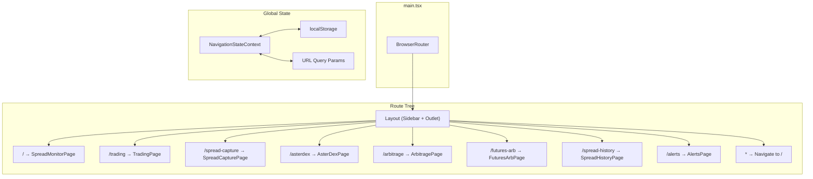

# Design Document: Page-Based Navigation

## Overview

Рефакторинг навигации фронтенд-приложения MEXC Spread Monitor с модальной архитектуры (overlay-диалоги через `useState` в `App.tsx`) на полноценную страничную маршрутизацию с использованием `react-router-dom` v6. Каждый раздел приложения получает собственный URL-маршрут, боковую навигационную панель (Sidebar) и сохранение глобального состояния (биржа, рынок, фильтры) через React Context + localStorage.

### Ключевые решения

1. **react-router-dom v6** — стандартная библиотека маршрутизации для React, поддерживает вложенные маршруты, `<Outlet>`, и lazy loading
2. **Layout-обёртка с `<Outlet>`** — единый Layout-компонент содержит Sidebar и область контента, страницы рендерятся через `<Outlet>`
3. **React Context для глобального состояния** — `NavigationStateContext` хранит exchange, market, filters и синхронизирует с localStorage
4. **Постепенная миграция** — модальные компоненты оборачиваются в Page-компоненты без изменения внутренней логики

## Architecture



### Структура файлов

```
frontend/src/
├── main.tsx                    # BrowserRouter + NavigationStateProvider
├── App.tsx                     # Route definitions (упрощённый)
├── components/
│   ├── Layout.tsx              # Sidebar + Outlet + responsive logic
│   ├── Sidebar.tsx             # Navigation panel (collapse/expand)
│   └── MobileDrawer.tsx        # Mobile sidebar overlay
├── pages/
│   ├── SpreadMonitorPage.tsx   # Главная (текущий App.tsx контент)
│   ├── TradingPage.tsx         # Обёртка TradingAdminModal
│   ├── SpreadCapturePage.tsx   # Обёртка SpreadCapturePanel
│   ├── AsterDexPage.tsx        # Обёртка AsterDexPanel
│   ├── ArbitragePage.tsx       # Обёртка ArbitragePanel
│   ├── FuturesArbPage.tsx      # Обёртка FuturesArbPanel
│   ├── SpreadHistoryPage.tsx   # Обёртка CrossSpreadHistoryChart
│   └── AlertsPage.tsx          # Обёртка AlertsSettingsPanel
├── context/
│   └── NavigationStateContext.tsx  # Exchange, market, filters
└── hooks/
    └── useNavigationState.ts   # Hook для доступа к контексту
```

## Components and Interfaces

### 1. NavigationStateContext

```typescript
interface NavigationState {
  exchange: Exchange;
  market: Market;
  filters: FilterState;
}

interface FilterState {
  quote: string;        // "Все" | "USDT" | "BTC" | ...
  minSpread: number;    // минимальный спред bps
  minVolume: number;    // минимальный объём
  search: string;       // поисковая строка
}

interface NavigationStateContextValue {
  state: NavigationState;
  setExchange: (exchange: Exchange) => void;
  setMarket: (market: Market) => void;
  setFilters: (filters: Partial<FilterState>) => void;
  resetFilters: () => void;
}
```

**Логика инициализации (приоритет):**
1. URL query params (`?exchange=binance&market=futures`)
2. localStorage (`mexc-nav-exchange`, `mexc-nav-market`)
3. Defaults: `{ exchange: "mexc", market: "spot", filters: { quote: "Все", minSpread: 0, minVolume: 0, search: "" } }`

**Синхронизация:**
- При изменении exchange/market → запись в localStorage
- URL query params читаются только при инициализации (не синхронизируются постоянно)

### 2. Layout Component

```typescript
interface LayoutProps {
  // Нет props — использует Outlet из react-router
}
```

**Поведение:**
- Desktop (≥768px): Sidebar фиксирован слева (240px развёрнут / 64px свёрнут), контент справа
- Mobile (<768px): Sidebar скрыт, кнопка-гамбургер в header, Sidebar как drawer поверх контента
- Высота: `100vh`, overflow только в области контента

### 3. Sidebar Component

```typescript
interface SidebarProps {
  collapsed: boolean;
  onToggleCollapse: () => void;
  onNavigate?: () => void;  // для закрытия mobile drawer
}

interface NavItem {
  path: string;
  label: string;
  icon: LucideIcon;
}
```

**Навигационные пункты:**

| Path | Label | Icon |
|------|-------|------|
| `/` | Spread Monitor | Activity |
| `/trading` | Trading Admin | Shield |
| `/spread-capture` | Spread Capture | Download |
| `/asterdex` | AsterDEX | Zap |
| `/arbitrage` | Арбитраж | ArrowUpDown |
| `/futures-arb` | Futures Arb | ChartLine |
| `/spread-history` | История спреда | ChartCandlestick |
| `/alerts` | Алерты | Bell |

**Активный пункт:** определяется через `useLocation().pathname` и сравнение с `item.path`. Активный пункт получает `bg-accent/15 font-bold text-accent`.

**Свёрнутый режим:** ширина 64px, только иконки, tooltip с названием при hover (300ms delay через CSS `transition-delay` или `title` attribute).

### 4. Page Components

Каждый Page-компонент — тонкая обёртка:

```typescript
// Пример: TradingPage.tsx
export function TradingPage() {
  return (
    <div className="h-full overflow-auto p-4">
      <TradingAdminModal />  {/* без modal wrapper */}
    </div>
  );
}
```

**Изменения в существующих компонентах:**
- Удалить modal-обрамление (overlay, backdrop, X-кнопка)
- Адаптировать ширину: `max-w-*` → `w-full`
- Добавить самостоятельную загрузку данных (если зависели от props из App)
- Сохранить всю внутреннюю логику без изменений

### 5. Router Configuration (App.tsx)

```typescript
import { BrowserRouter, Routes, Route, Navigate } from "react-router-dom";

function App() {
  return (
    <BrowserRouter>
      <NavigationStateProvider>
        <Routes>
          <Route element={<Layout />}>
            <Route index element={<SpreadMonitorPage />} />
            <Route path="trading" element={<TradingPage />} />
            <Route path="spread-capture" element={<SpreadCapturePage />} />
            <Route path="asterdex" element={<AsterDexPage />} />
            <Route path="arbitrage" element={<ArbitragePage />} />
            <Route path="futures-arb" element={<FuturesArbPage />} />
            <Route path="spread-history" element={<SpreadHistoryPage />} />
            <Route path="alerts" element={<AlertsPage />} />
            <Route path="*" element={<Navigate to="/" replace />} />
          </Route>
        </Routes>
      </NavigationStateProvider>
    </BrowserRouter>
  );
}
```

### 6. Vite Configuration

```typescript
// vite.config.ts additions
export default defineConfig({
  plugins: [react()],
  server: {
    port: 5173,
    proxy: {
      "/api": {
        target: "http://127.0.0.1:8000",
        changeOrigin: true,
      },
    },
    // Vite dev server already handles SPA fallback by default
    // (returns index.html for non-file requests)
  },
});
```

### 7. FastAPI SPA Fallback

```python
# backend/main.py — catch-all route (после всех /api/ routes)
from fastapi.staticfiles import StaticFiles
from fastapi.responses import FileResponse

# Mount static files
app.mount("/assets", StaticFiles(directory="frontend/dist/assets"), name="assets")

@app.get("/{full_path:path}")
async def spa_fallback(full_path: str):
    """SPA fallback: return index.html for all non-API, non-static paths."""
    file_path = Path("frontend/dist") / full_path
    if file_path.is_file():
        return FileResponse(file_path)
    return FileResponse("frontend/dist/index.html")
```

## Data Models

### NavigationState (localStorage)

```typescript
// Keys in localStorage:
// "mexc-nav-exchange" → Exchange string
// "mexc-nav-market" → Market string
// "mexc-nav-filters" → JSON string of FilterState

// Existing keys preserved:
// "mexc-ui-display" → DisplayMode
// "mexc-ui-tiles-variant" → TilesVariant
// "mexc-ui-tiles-max-symbols" → number
```

### URL Query Parameters

```
?exchange=binance&market=futures
```

Только `exchange` и `market` отражаются в URL. Фильтры хранятся только в localStorage (слишком длинные для URL).

### Route → Component Mapping

```typescript
const ROUTE_MAP: Record<string, React.ComponentType> = {
  "/": SpreadMonitorPage,
  "/trading": TradingPage,
  "/spread-capture": SpreadCapturePage,
  "/asterdex": AsterDexPage,
  "/arbitrage": ArbitragePage,
  "/futures-arb": FuturesArbPage,
  "/spread-history": SpreadHistoryPage,
  "/alerts": AlertsPage,
};

const VALID_ROUTES = Object.keys(ROUTE_MAP);
```

## Correctness Properties

*A property is a characteristic or behavior that should hold true across all valid executions of a system — essentially, a formal statement about what the system should do. Properties serve as the bridge between human-readable specifications and machine-verifiable correctness guarantees.*

### Property 1: Unknown routes redirect to root

*For any* URL path that is not in the set of valid routes (`/`, `/trading`, `/spread-capture`, `/asterdex`, `/arbitrage`, `/futures-arb`, `/spread-history`, `/alerts`), navigating to that path SHALL result in a redirect to `/`.

**Validates: Requirements 2.9**

### Property 2: Active sidebar item matches current route

*For any* valid route path, when the application is at that route, the sidebar navigation item corresponding to that path SHALL have active styling (distinct background color and bold text), and all other items SHALL NOT have active styling.

**Validates: Requirements 3.2**

### Property 3: Sidebar navigation triggers correct route

*For any* sidebar navigation item, clicking that item SHALL update the browser URL to the item's corresponding route path.

**Validates: Requirements 3.3**

### Property 4: Global state preservation across navigation

*For any* navigation state (exchange, market, filters) and *for any* sequence of page transitions between valid routes, the navigation state values SHALL remain unchanged after all transitions complete.

**Validates: Requirements 5.1, 5.2, 5.3**

### Property 5: State restoration priority (URL over localStorage)

*For any* valid exchange value stored in localStorage and *for any* different valid exchange value present in URL query params, when the application initializes, the NavigationState SHALL use the URL query param value (not the localStorage value).

**Validates: Requirements 5.4**

### Property 6: State persistence round-trip

*For any* valid exchange or market value, when that value is set via the NavigationState context, reading the corresponding localStorage key SHALL return that same value.

**Validates: Requirements 5.6**

## Error Handling

### Навигация

| Сценарий | Обработка |
|----------|-----------|
| Несуществующий маршрут | `<Navigate to="/" replace />` — тихий редирект на главную |
| Ошибка загрузки lazy-компонента | ErrorBoundary с кнопкой "Перезагрузить" |
| Невалидный exchange/market в URL | Игнорировать, использовать localStorage или defaults |

### Загрузка данных

| Сценарий | Обработка |
|----------|-----------|
| API недоступен при загрузке страницы | Показать сообщение об ошибке + кнопка "Повторить" |
| Невалидный JSON в localStorage | Очистить ключ, использовать defaults |
| localStorage недоступен (private mode) | Работать только в памяти, без персистенции |

### Responsive

| Сценарий | Обработка |
|----------|-----------|
| Resize viewport через breakpoint 768px | Автоматическое переключение desktop/mobile режима |
| Навигация в mobile drawer | Закрыть drawer после перехода |

## Testing Strategy

### Property-Based Tests (vitest + fast-check)

Библиотека: **fast-check** — стандартная PBT-библиотека для TypeScript/JavaScript.

Конфигурация: минимум 100 итераций на каждый property test.

Каждый тест помечен комментарием:
```typescript
// Feature: page-based-navigation, Property N: <property text>
```

**Тестируемые свойства:**
1. Unknown routes → redirect (генерация случайных путей)
2. Active sidebar matches route (перебор всех маршрутов)
3. Nav click → correct URL (перебор всех nav items)
4. State preservation across navigation (случайные состояния + переходы)
5. URL > localStorage priority (случайные значения в обоих источниках)
6. State persistence round-trip (случайные exchange/market значения)

### Unit Tests (vitest + @testing-library/react)

- Рендеринг каждого Page-компонента без ошибок
- Layout responsive behavior (mock viewport)
- Sidebar collapse/expand
- Default state initialization
- Error boundary behavior

### Integration Tests

- Full navigation flow: render app → click sidebar → verify page content
- Deep link: render app at `/trading` → verify TradingPage renders
- Browser back/forward simulation
- FastAPI SPA fallback (pytest)

### Что НЕ тестируется PBT

- UI rendering и CSS (визуальные тесты)
- react-router-dom internal behavior
- Vite/FastAPI configuration (smoke tests)
- Modal overlay behavior (example-based)
