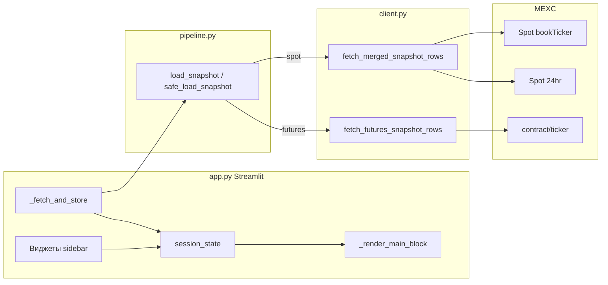

# Архитектура веб-приложения MEXC Spread Monitor

Документ описывает структуру проекта, зоны ответственности модулей, потоки данных и взаимодействие с биржей MEXC. Процесс установки и запуска вынесен в отдельный файл: [ZAPUSK.md](ZAPUSK.md).

---

## 1. Назначение системы

Приложение — **дашборд** (Streamlit и/или React) поверх общего ядра `mexc_monitor`, который:

- загружает с публичных API MEXC **лучшие bid/ask** и метрики (**спред abs / bps**);
- для **спота** подмешивает **объёмы 24h** (база и котировка); для **фьючерсов** — **объёмы и funding** из тикера контракта;
- применяет **whitelist/blacklist** пар из конфигурации, штампует **`observed_at`**, обогащает строки **моделью исполнения** (комиссии round-trip taker, чистый спред, оценка L1);
- опционально пишет снимки в **SQLite** через **SQLAlchemy ORM** и отдаёт **`GET /api/history/recent`**;
- для **фьючерсов** опционально использует **WebSocket** `sub.tickers` (все тикеры) с fallback на REST и опционально **WebSocket стакан** `sub.depth` / `push.depth` для **L1** по выбранным контрактам;
- для HTTP применяет **retry/back-off** и **минимальный интервал** между запросами (настраивается);
- позволяет **фильтровать, сортировать, экспортировать CSV** и **автообновлять** данные.

**Аутентификация на бирже не используется** для сбора — только публичные запросы.

---

## 2. Дерево каталогов и файлы

```
mexc_spread_monitor/
├── app.py                 # Точка входа Streamlit
├── run_app.bat            # Запуск Streamlit (Windows)
├── run_modern.bat         # Один терминал: FastAPI + Vite (concurrently)
├── package.json           # npm run dev:modern — API + UI в одной консоли
├── scripts/
│   └── uvicorn-cli.cjs    # Запуск uvicorn из .venv (кроссплатформенный путь)
├── requirements.txt
├── pyproject.toml
├── backend/
│   └── main.py            # FastAPI: /api/snapshot, /api/klines, CORS
├── frontend/              # React + Vite + TypeScript + Tailwind
│   ├── package.json
│   ├── vite.config.ts
│   ├── src/App.tsx
│   └── src/filters.ts     # Зеркало правил фильтрации для браузера
├── config/
│   └── external_apis.json   # Базовые URL и пути MEXC (и справочно — charting)
├── docs/
│   ├── ARCHITECTURE.md
│   ├── BUSINESS.md      # Бизнес-процессы и трейдерская логика
│   └── ZAPUSK.md
└── mexc_monitor/
    ├── config.py
    ├── models.py
    ├── metrics.py
    ├── execution.py       # Обогащение строк: net spread, L1, reference notional
    ├── client.py
    ├── http_utils.py      # GET с retry/back-off и pacing
    ├── futures_rows.py    # Нормализация строк фьючерсов (REST/WS)
    ├── ws_futures.py      # Опциональный WebSocket фьючерсных тикеров (sub.tickers)
    ├── ws_futures_orderbook.py  # Опциональный WS стакан фьючерсов (sub.depth → L1)
    ├── symbol_filter.py   # Whitelist/blacklist по Settings
    ├── history_store.py   # Запись/чтение истории (ORM)
    ├── history_worker.py  # Фоновый сбор в SQLite
    ├── klines.py          # Свечи MEXC (spot /api/v3/klines, futures contract/kline)
    ├── pipeline.py
    ├── filters.py         # Фильтры UI по снимку (эталон для frontend)
    ├── trading/           # Торговый контур (paper/live), risk checks, private API client
    │   ├── engine.py
    │   ├── private_client.py
    │   └── risk.py
    └── orm/               # SQLAlchemy: Base, SpreadSnapshot, engine, миграции колонок
        ├── base.py
        ├── models.py
        └── engine.py
```

Принцип разделения: **`mexc_monitor`** — ядро; **`app.py`** — Streamlit; **`backend/` + `frontend/`** — современный UI.

---

## 3. Слои архитектуры

### 3.1. Слой представления — `app.py`

| Компонент | Ответственность |
|-----------|-----------------|
| **Конфигурация страницы** | `st.set_page_config`, заголовок. |
| **Боковая панель** | Выбор рынка (спот/фьючерсы), фильтры, сортировка, автообновление, кнопка принудительного обновления. |
| **`st.session_state`** | Хранение снимка таблицы, ошибок, времени загрузки, флагов обновления, согласованности «снимок ↔ выбранный рынок». |
| **`_fetch_and_store()`** | Вызов `safe_load_snapshot(market=...)` и запись результата в `session_state`. |
| **`_apply_filters()` / `_quote_suffix_for_filter()`** | Локальная фильтрация **без повторного запроса к API** (по суффиксу символа, мин. спреду, мин. объёму, подстроке поиска, сортировка). |
| **`_render_main_block()`** | Метрики, таблица `st.dataframe`, конфигурация колонок, кнопка выгрузки CSV. |
| **Режим без автообновления** | При первом заходе или по флагу — полный перезапуск скрипта и загрузка данных. |
| **Режим с автообновлением** | `@st.fragment(run_every=timedelta(...))`: периодический перезапуск **только фрагмента**; внутри — троттлинг, чтобы не вызывать API при каждом изменении фильтра на полном перезапуске страницы. |

**Важно:** Streamlit при любом взаимодействии с виджетом **перезапускает весь скрипт сверху вниз**. Поэтому «тяжёлая» загрузка с биржи отделена от «лёгкой» перерисовки фильтров: снимок хранится в `session_state`, а повторные запросы в авторежиме ограничены по времени.

---

### 3.2. Слой оркестрации данных — `pipeline.py`

| Функция / тип | Ответственность |
|---------------|-----------------|
| **`MarketId`** | Литерал `"spot"` \| `"futures"` \| `"cross"` — выбор ветки загрузки. |
| **`rows_to_dataframe()`** | Преобразование списка `BookTickerRow` в `pandas.DataFrame` с фиксированным набором колонок (в т.ч. пустой каркас при отсутствии строк). |
| **`load_snapshot(market, settings)`** | Для `spot` — `fetch_merged_snapshot_rows`; для `futures` — `fetch_futures_snapshot_rows` → **`filter_rows_by_universe`** → метка **`observed_at`** (UTC ISO) → **`enrich_row_execution`** (комиссии, net spread, L1) → `rows_to_dataframe`. |
| **`safe_load_snapshot(market, settings)`** | Обёртка: перехват `MexcApiError` и прочих исключений, возврат `(DataFrame \| None, error_string \| None)` — удобно для UI без try/except в каждом месте. |

Здесь **нет HTTP** и **нет Streamlit** — оркестрация клиента, universe-фильтр, время наблюдения и бизнес-обогащение строк.

### 3.2.1. Фильтрация снимка — `filters.py`

| Функция | Ответственность |
|---------|-----------------|
| **`quote_suffix_for_filter(market, raw)`** | Нормализация поля «котировка»: спот `USDT`, фьючерсы `_USDT` и правило с префиксом `_`. |
| **`apply_market_filters(df, ...)`** | Фильтрация и сортировка **локально** по уже загруженному `DataFrame` (те же параметры, что в боковой панели Streamlit). |

Используется **`app.py`** (Streamlit). Современный UI повторяет логику в TypeScript (`frontend/src/filters.ts`), чтобы не дергать API при каждом изменении фильтра.

---

### 3.3. Слой доступа к API — `client.py`

Единая точка для **httpx**, разбора JSON и приведения типов.

| Сущность | Ответственность |
|----------|-----------------|
| **`MexcApiError`** | Ошибка домена (невалидный JSON, неожиданная форма ответа, `success=false` у фьючерсного API). |
| **`_parse_float()`** | Безопасное приведение строк/чисел из API к `float`. |
| **`fetch_all_book_tickers()`** | Спот: `GET .../api/v3/ticker/bookTicker` без `symbol` — все пары; парсинг `bidPrice`/`askPrice`/количеств. |
| **`fetch_24hr_volume_map()`** | Спот: `GET .../api/v3/ticker/24hr` — словарь `symbol → (volume, quoteVolume)`. |
| **`fetch_merged_snapshot_rows()`** | Спот: в **одном** `httpx.Client` два запроса подряд (bookTicker + 24hr), затем `dataclasses.replace` для подстановки объёмов в строки. |
| **`fetch_futures_snapshot_rows()`** | Фьючерсы: при `futures_ticker_source=websocket` — свежий буфер из **`ws_futures`** (если не протух); иначе `GET .../contract/ticker`. Разбор `bid1`/`ask1` или `maxBidPrice`/`minAskPrice` (WS batch) через **`futures_ticker_item_to_row`**. При **`futures_orderbook_ws_enabled`** — после этого **`ws_futures_orderbook.apply_futures_depth_top_to_rows`**: подмена bid/ask и количеств L1 из **`push.depth`** для символов из списка или первых 30 из whitelist (лимит одного WS-соединения MEXC). |
| **`_normalize_*`** | Отбрасывание битых строк (нет символа, невалидные цены, `ask < bid`). |

**HTTP-устойчивость:** **`http_utils.get_with_retry`** — повторы при сетевых ошибках и статусах 429/502/503/504, экспоненциальный back-off; **`RequestPacer`** — минимальный интервал между GET в одной сессии (`http_min_request_interval_sec`).

**Веса лимитов (ориентир по документации MEXC):** bookTicker — 10, ticker/24hr — 25; фьючерсы — см. Futures API. Дополнительно: pacing в настройках, кэш снимка на backend (`MEXC_SNAPSHOT_CACHE_TTL_SEC`), опционально WS для фьючерсов.

---

### 3.4. Конфигурация — `config.py` и `config/external_apis.json`

Класс **`Settings`** (frozen dataclass) включает в том числе:

| Группа | Поля (фрагмент) |
|--------|------------------|
| **HTTP MEXC** | `base_url`, пути bookTicker / 24hr / klines, фьючерсы `contract_ticker_path`, `timeout_sec` |
| **Устойчивость HTTP** | `http_max_retries`, `http_retry_backoff_sec`, `http_max_retry_wait_sec`, `http_min_request_interval_sec` |
| **Фьючерсы WS** | `futures_ws_url`, `futures_ticker_source` (`rest` \| `websocket`), `futures_ws_stale_after_sec`; стакан: `futures_orderbook_ws_enabled`, `futures_orderbook_ws_symbols`, `futures_orderbook_ws_stale_after_sec` |
| **Universe** | `spot_symbols_whitelist/blacklist`, `futures_symbols_whitelist/blacklist` |
| **История** | `history_enabled`, `history_db_path`, `history_interval_sec`, `history_markets` |
| **Исполнение (модель)** | `exec_spot_taker_fee_bps`, `exec_futures_taker_fee_bps`, `exec_reference_quote_notional` |

Сборка настроек: **`load_settings_from_file()`** читает JSON (ветки **`mexc`**, **`history`**, **`execution`**), затем **`_apply_env_overrides`** (см. `_comment` в `external_apis.json`: `MEXC_*`). Путь к файлу: **`MEXC_MONITOR_EXTERNAL_APIS_CONFIG`**. После правок — **перезапуск** Streamlit/uvicorn.

Ключ **`charting`** — справочный для фронтенда; **`execution._comment`** в JSON допускается как человекочитаемая подсказка.

**`DEFAULT_SETTINGS`** — снимок при импорте модуля; явный `Settings` можно передать в `load_snapshot(..., settings=...)`.

Современный фронтенд ходит на свой backend (`/api/...`). Базовый URL при необходимости задаётся в **`frontend/.env`** как **`VITE_API_BASE_URL`** (см. `frontend/src/config.ts`); в dev по умолчанию пустая строка — запросы идут на origin Vite с прокси на порт 8000.

---

### 3.5. Модель строки — `models.py`

**`BookTickerRow`** (имя историческое — строка используется и для спота, и для фьючерсов):

| Поле | Смысл |
|------|--------|
| `symbol` | Спот: `BTCUSDT`. Фьючерсы: `BTC_USDT`. |
| `bid`, `ask` | Лучшие цены. |
| `bid_qty`, `ask_qty` | Объёмы на лучшем уровне (спот из API; фьючерсы — из тикера или из **WS стакана** `push.depth`, если включено и есть свежие данные; иначе часто 0). |
| `mid`, `spread_abs`, `spread_bps` | Рассчитываются в `metrics.py`. |
| `volume_24h_base`, `volume_24h_quote` | Спот: из 24hr. Фьючерсы: `volume24` / `amount24`. |
| `funding_rate` | Только фьючерсы; спот — `None`. |
| `observed_at` | ISO8601 UTC — время фиксации снимка (одна метка на все строки запроса). |
| `fee_round_trip_bps`, `net_spread_bps` | После **`execution.enrich_row_execution`**: модель 2×taker(one-way), чистый спред в bps. |
| `l1_max_executable_base`, `l1_max_notional_quote` | Оценка по L1: `min(bid_qty, ask_qty)` и × `mid`; на фьючерсах часто 0 (нет qty в тикере). |
| `reference_quote_notional`, `l1_covers_reference_notional` | Эталонный размер в USDT и флаг «L1 покрывает», если задано в конфиге. |

Смысл метрик для трейдера — в **[BUSINESS.md](BUSINESS.md)**.

---

### 3.6. Метрики — `metrics.py`

**`compute_mid_spread(bid, ask)`** возвращает:

- `mid = (bid + ask) / 2`;
- `spread_abs = ask - bid`;
- `spread_bps = 10_000 * spread_abs / mid` или `None`, если `mid <= 0`.

Дополнительно: **`round_trip_taker_fee_bps`**, **`net_spread_after_fees_bps`** — для слоя исполнения.

**bps (basis points)** здесь — относительный спред к mid в долях от 10 000 (удобно сравнивать пары с разной ценой).

---

### 3.7. Фильтр списка инструментов — `symbol_filter.py`

**`filter_rows_by_universe(rows, market, settings)`** — после загрузки **всех** пар с биржи отбрасывает символы вне **whitelist** (если он непустой) и в **blacklist**. Нормализация: спот — верхний регистр; фьючерсы — `BTC_USDT`. Не снижает вес REST bookTicker/24hr на стороне MEXC, только уменьшает объём данных в UI и в истории.

---

### 3.8. Модель исполнения — `execution.py`

**`enrich_row_execution(row, market, settings)`** выставляет поля комиссий и L1 (см. таблицу в п. 3.5). Использует тарифы из `Settings` и **`metrics.net_spread_after_fees_bps`**.

---

### 3.9. История и ORM — `history_store.py`, `history_worker.py`, `mexc_monitor/orm/`

| Компонент | Роль |
|-----------|------|
| **`SpreadSnapshot`** | SQLAlchemy-модель таблицы `spread_snapshots` (в т.ч. поля net spread и L1). |
| **`create_schema` / `get_engine`** | SQLite URL, `create_all`, **миграция** недостающих колонок через `ALTER TABLE`. |
| **`append_snapshot`**, **`query_recent`** | Пакетная вставка из `DataFrame`; выборка для **`GET /api/history/recent`**. |
| **`history_worker`** | Фоновый поток: по `history_interval_sec` вызывает `safe_load_snapshot` по рынкам из `history_markets`. |

Streamlit при старте вызывает **`start_history_worker()`**; FastAPI — на **`startup`** / **`shutdown`**.

---

### 3.10. Торговый контур (MVP) — `mexc_monitor/trading/`

Добавлен отдельный слой для автоматизации исполнения, не вмешивающийся в базовый data-pipeline.

| Компонент | Роль |
|-----------|------|
| **`trading/engine.py`** | `TradingEngine`: цикл, состояние, kill switch, `paper/live` режимы, журнал событий. |
| **`trading/private_client.py`** | Подписанные приватные REST-запросы MEXC (HMAC SHA256, `X-MEXC-APIKEY`). |
| **`trading/risk.py`** | Базовый риск-контур: лимиты по количеству ордеров/ошибок/открытых ордеров. |
| **`backend/main.py`** | Управление движком через `/api/trading/*` endpoints. |

Ключи API в коде не хранятся: используются только переменные окружения (`MEXC_API_KEY`, `MEXC_API_SECRET`).

Подробно процесс, env и API управления описаны в [TRADING.md](TRADING.md).

---

## 4. Поток данных (обобщённо)



---

## 5. Состояние сессии Streamlit (`session_state`)

Ключи, за которыми полезно следить при доработках:

| Ключ | Назначение |
|------|------------|
| `flt_market` | `"spot"` или `"futures"`. |
| `flt_quote`, `flt_min_bps`, `flt_min_vol_quote`, `flt_search` | Фильтры. |
| `flt_sort`, `flt_asc` | Сортировка. |
| `flt_auto`, `flt_refresh_sec` | Автообновление и интервал. |
| `flt_force_refresh` | Принудительная загрузка после кнопки «Обновить сейчас» или смены рынка. |
| `snapshot_df` | Последний успешный `DataFrame`. |
| `snapshot_error` | Текст ошибки, если загрузка не удалась. |
| `snapshot_loaded_at` | Время UTC последней успешной загрузки. |
| `_snapshot_for_market` | С каким `flt_market` был получен текущий снимок (согласованность при переключении рынка). |
| `_last_fetch_mono` | Монотонное время последнего запроса к API в режиме фрагмента (троттлинг). |

При смене рынка UI очищает снимок и выставляет `flt_force_refresh`, чтобы не показывать таблицу «чужого» рынка.

---

## 6. Внешние зависимости

| Пакет | Роль |
|--------|------|
| **streamlit** | Веб-UI, виджеты, фрагменты, `session_state`. |
| **httpx** | HTTP-клиент, переиспользование соединения в спот-снимке. |
| **pandas** | Табличное представление, фильтрация, CSV. |
| **fastapi** / **uvicorn** | REST API для современного UI. |
| **sqlalchemy** | ORM для истории SQLite. |
| **websocket-client** | Опционально: фьючерсные тикеры (`sub.tickers`) и/или стакан (`sub.depth`). |

Версии зафиксированы в `requirements.txt` / `pyproject.toml` (в т.ч. Streamlit ≥ 1.33 для `@st.fragment(run_every=...)`).

---

## 7. Ограничения и возможные расширения

**Текущие ограничения:**

- Снимок **точечный** (`observed_at`); между опросами рынок меняется — см. [BUSINESS.md](BUSINESS.md).
- **L1-only** для оценки размера: без стакана глубже проскальзывание для крупного объёма не считается.
- Фьючерсы: количества на L1 в данных тикера **часто отсутствуют** → L1-метрики могут быть нулевыми (см. опцию **`futures_orderbook_ws_enabled`**).
- Whitelist/blacklist **не** уменьшает число запросов к MEXC (фильтрация после ответа).
- Один процесс Streamlit; горизонтальное масштабирование не предусмотрено.

**Идеи расширения:**

- Спот: потоки стакана/bookTicker в Protobuf на MEXC — при необходимости отдельный декодер или гибрид REST+WS.
- Полный стакан (не только L1), несколько WS-соединений при >30 подписок.
- **Спот–фьючерс базис** и сопоставление пар (`BTCUSDT` ↔ `BTC_USDT`): сценарии и границы применимости — **[BUSINESS.md](BUSINESS.md)** (раздел 5).
- Учёт maker/VIP, funding в «чистой» экономике удержания; алерты (Telegram и т.д.).

---

## 8. Современный стек (FastAPI + React)

Параллельно со Streamlit доступен UI на **React 18 + Vite 5 + TypeScript + Tailwind CSS** и шрифты DM Sans / JetBrains Mono.

### 8.1. Назначение слоёв

| Компонент | Путь | Роль |
|-----------|------|------|
| **REST API** | `backend/main.py` | FastAPI: `GET /api/health`, `GET /api/snapshot?market=spot\|futures`, `GET /api/history/recent?...`, `GET /api/klines?...`, а также `GET /api/trading/status`, `POST /api/trading/start`, `POST /api/trading/stop`, `POST /api/trading/kill-switch`, `POST /api/trading/run-once`. Снимок — `safe_load_snapshot`; свечи — `mexc_monitor.klines`. Серверный кэш снимка: `MEXC_SNAPSHOT_CACHE_TTL_SEC`. |
| **CORS** | `backend/main.py` | Разрешённые origin: `localhost:5173` / `4173` (Vite dev и preview). |
| **SPA** | `frontend/src/` | `App.tsx` — снимок, фильтры, список / плитки (карточки или мини-графики), чипы сортировки для плиток; `ChartModal.tsx`, `MiniSparkline.tsx` — [Lightweight Charts](https://github.com/tradingview/lightweight-charts). |
| **Прокси разработки** | `frontend/vite.config.ts` | Запросы `/api/*` проксируются на `http://127.0.0.1:8000`, чтобы не настраивать CORS для произвольных портов вручную. |
| **Клиентские фильтры** | `frontend/src/filters.ts` | Те же правила, что `mexc_monitor/filters.py`, чтобы после одного запроса к бирже фильтры применялись в браузере без задержки. |

### 8.2. Поток данных (современный UI)


### 8.3. Запуск

См. [ZAPUSK.md](ZAPUSK.md) — раздел «Современный UI»: `run_modern.bat` или `npm run dev:modern` в корне.

---

## 9. Связанные документы

- [BUSINESS.md](BUSINESS.md) — бизнес-процессы, метрики и трейдерская интерпретация.
- [TRADING.md](TRADING.md) — процесс и функционал автоторговли (paper/live, risk, API управления).
- [ZAPUSK.md](ZAPUSK.md) — установка Python, Node.js, виртуальное окружение, `run_app.bat`, `run_modern.bat`, ручной запуск, типичные проблемы.
