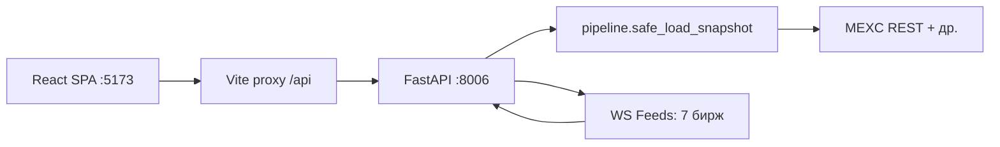

# Архитектура веб-приложения MEXC Spread Monitor

Документ описывает структуру проекта, зоны ответственности модулей, потоки данных и взаимодействие с биржами. Процесс установки и запуска вынесен в отдельный файл: [ZAPUSK.md](ZAPUSK.md).

---

## 1. Назначение системы

Приложение — **мультибиржевой терминал мониторинга и арбитража** (React + FastAPI), который:

- загружает с публичных API **лучшие bid/ask** и метрики (**спред abs / bps**) с 10+ бирж (MEXC, Binance, Bybit, OKX, Gate.io, HTX, Bitget, AsterDEX, dYdX, Hyperliquid);
- для **спота** подмешивает **объёмы 24h** (база и котировка); для **фьючерсов** — **объёмы и funding** из тикера контракта;
- применяет **whitelist/blacklist** пар из конфигурации, штампует **`observed_at`**, обогащает строки **моделью исполнения** (комиссии round-trip taker, чистый спред, оценка L1);
- опционально пишет снимки в **SQLite** через **SQLAlchemy ORM** и отдаёт **`GET /api/history/recent`**;
- для **фьючерсов** использует **WebSocket** (тикеры, стакан) с fallback на REST;
- обеспечивает **межбиржевой арбитраж**, **спот-фьючерсный арбитраж** (Spread Sniper), **Lead-Lag анализ**, **MetaScalp интеграцию**;
- позволяет **фильтровать, сортировать, экспортировать CSV** и **автообновлять** данные.

**Аутентификация на бирже не используется** для сбора — только публичные запросы.

---

## 2. Дерево каталогов и файлы

```
mexc_spread_monitor/
├── run_modern.bat         # Один терминал: FastAPI + Vite (concurrently)
├── package.json           # npm run dev:modern — API + UI в одной консоли
├── scripts/
│   └── uvicorn-cli.cjs    # Запуск uvicorn из .venv (кроссплатформенный путь)
├── requirements.txt
├── pyproject.toml
├── backend/
│   └── main.py            # FastAPI: REST API, WS-мосты, торговые движки
├── frontend/              # React + Vite + TypeScript + Tailwind
│   ├── package.json
│   ├── vite.config.ts
│   ├── src/
│   │   ├── App.tsx        # Роутинг (React Router v6), lazy-загрузка страниц
│   │   ├── config.ts      # API_BASE_URL, adminTokenReady, apiFetch()
│   │   ├── filters.ts     # Зеркало правил фильтрации для браузера
│   │   ├── pages/         # 11 страниц (см. раздел 3)
│   │   ├── components/    # Layout, Sidebar, GlobalAssetBar, KillSwitch и др.
│   │   ├── hooks/         # useNavBadges и др.
│   │   └── context/       # NavigationStateContext
│   └── dist/              # Собранный SPA (для продакшена)
├── config/
│   └── external_apis.json # Базовые URL и пути MEXC (и справочно — charting)
├── docs/
│   ├── ARCHITECTURE.md
│   ├── BUSINESS.md        # Бизнес-процессы и трейдерская логика
│   ├── TRADING.md         # Автоторговля
│   └── ZAPUSK.md
└── mexc_monitor/          # Ядро — бизнес-логика
    ├── config.py
    ├── models.py
    ├── metrics.py
    ├── execution.py       # Обогащение строк: net spread, L1, reference notional
    ├── client.py
    ├── http_utils.py      # GET с retry/back-off и pacing
    ├── futures_rows.py    # Нормализация строк фьючерсов (REST/WS)
    ├── ws_futures.py      # WebSocket фьючерсных тикеров (sub.tickers)
    ├── ws_futures_orderbook.py  # WS стакан фьючерсов (sub.depth → L1)
    ├── ws_spot_orderbook.py     # WS стакан спота
    ├── symbol_filter.py   # Whitelist/blacklist по Settings
    ├── history_store.py   # Запись/чтение истории (ORM)
    ├── history_worker.py  # Фоновый сбор в SQLite
    ├── klines.py          # Свечи (spot / futures)
    ├── pipeline.py
    ├── filters.py         # Фильтры UI по снимку (эталон для frontend)
    ├── spread_capture.py  # Движок захвата спреда
    ├── portfolio_risk.py  # Агрегированный риск-менеджмент
    ├── trading/           # Торговый контур (paper/live), per-exchange движки
    │   ├── engine.py
    │   ├── engine_registry.py
    │   ├── exchange_config.py
    │   ├── exchanges.py
    │   ├── private_client.py
    │   └── risk.py
    ├── metascalp/         # MetaScalp интеграция
    │   ├── client.py
    │   ├── cache.py
    │   ├── poller.py
    │   ├── ws_bridge.py
    │   └── auto_trader.py
    └── orm/               # SQLAlchemy: Base, SpreadSnapshot, engine, миграции
        ├── base.py
        ├── models.py
        └── engine.py
```

Принцип разделения: **`mexc_monitor`** — ядро; **`backend/`** — FastAPI API; **`frontend/`** — React SPA.

---

## 3. Слои архитектуры

### 3.1. Frontend — React SPA

Стек: **React 18 + React Router v6 + Vite 5 + TypeScript + Tailwind CSS**, шрифты DM Sans / JetBrains Mono.

Страницы (ленивая загрузка через `lazy()`):

| Роут | Страница | Назначение |
|------|----------|------------|
| `/` | Spread Monitor | Главная таблица спредов (Bid/Ask/Spread/bps), фильтры, поиск, CSV |
| `/trading` | Trading Admin | Управление торговым движком (per-exchange: MEXC, Binance, Bybit...) |
| `/spread-capture` | Spread Capture | Автоматический захват спреда (monitor/paper/live) |
| `/asterdex` | AsterDEX | DEX perpetuals, тикеры, кросс-спреды MEXC ↔ Aster, funding |
| `/arbitrage` | Cross-Exchange Arbitrage | Межбиржевой арбитраж |
| `/multi-exchange` | Multi-Exchange | Сравнение фьючерсных пар по N биржам, кросс-спреды |
| `/futures-arb` | Spread Sniper | Спот vs фьючерсы, автоматические сделки |
| `/spread-history` | Spread History | График кросс-спреда (TradingView Lightweight Charts) |
| `/alerts` | Telegram Alerts | Настройка уведомлений в Telegram |
| `/lead-lag` | Lead-Lag | Анализ опережения цен между биржами |
| `/metascalp` | MetaScalp | Интеграция с MetaScalp (WS, ордера, позиции, basis monitor) |

Ключевые компоненты Layout:

| Компонент | Роль |
|-----------|------|
| **Sidebar** | 3 группы навигации (Мониторинг, Арбитраж, Торговля) с бейджами, сворачивание |
| **GlobalAssetBar** | Глобальный выбор биржи и тикера |
| **KillSwitchButton** | Экстренная остановка всех движков |
| **FeedsStatusWidget** | Статус WS-подключений к биржам |
| **PnlWidget** | PnL в реальном времени |
| **PortfolioRiskWidget** | Риск-менеджмент (экспозиция, лимиты) |

Аутентификация: на старте фронтенд получает `ADMIN_TOKEN` через `GET /api/admin-token` и сохраняет в localStorage. Все защищённые запросы отправляют заголовок `X-Admin-Token` через `apiFetch()`.

### 3.2. Backend — FastAPI

Единый API-сервер (`backend/main.py`, 3200+ строк) на FastAPI + uvicorn.

| Группа endpoints | Роль |
|------------------|------|
| `/api/health` | Статус системы и WS-фидов |
| `/api/snapshot` | Агрегированные данные по бирже/рынку (с кэшированием и prefetch) |
| `/api/history/recent` | История спредов из SQLite |
| `/api/klines` | Свечи (spot / futures) |
| `/api/metrics-reference` | Справочник метрик |
| `/api/trading/*` | Управление торговым движком (start/stop/status/run-once) |
| `/api/arbitrage/*` | Межбиржевой арбитраж |
| `/api/futures-arb/*` | Спот-фьючерсный арбитраж (Spread Sniper) |
| `/api/capture/*` | Spread Capture Engine |
| `/api/lead-lag/*` | Lead-Lag анализ |
| `/api/portfolio-risk/*` | Агрегированный риск |
| `/api/admin-token` | Выдача токена для UI |
| `/api/system/capabilities` | Доступные функции системы |

### 3.3. Слой оркестрации данных — `pipeline.py`

| Функция / тип | Ответственность |
|---------------|-----------------|
| **`MarketId`** | Литерал `"spot"` \| `"futures"` \| `"cross"` — выбор ветки загрузки. |
| **`rows_to_dataframe()`** | Преобразование списка `BookTickerRow` в `pandas.DataFrame`. |
| **`load_snapshot(market, settings)`** | Для `spot` — `fetch_merged_snapshot_rows`; для `futures` — `fetch_futures_snapshot_rows` → **`filter_rows_by_universe`** → **`observed_at`** → **`enrich_row_execution`** → `rows_to_dataframe`. |
| **`safe_load_snapshot(market, settings)`** | Обёртка: перехват ошибок, возврат `(DataFrame \| None, error_string \| None)`. |

Здесь **нет HTTP** — оркестрация клиента, universe-фильтр, время наблюдения и бизнес-обогащение строк.

### 3.4. Фильтрация снимка — `filters.py` / `frontend/src/filters.ts`

| Функция | Ответственность |
|---------|-----------------|
| **`quote_suffix_for_filter(market, raw)`** | Нормализация поля «котировка». |
| **`apply_market_filters(df, ...)`** | Фильтрация и сортировка по загруженному `DataFrame`. |

Современный UI дублирует логику в TypeScript (`frontend/src/filters.ts`), чтобы не дергать API при каждом изменении фильтра.

### 3.5. Слой доступа к API — `client.py`

Единая точка для **httpx**, разбора JSON и приведения типов.

| Сущность | Ответственность |
|----------|-----------------|
| **`MexcApiError`** | Ошибка домена. |
| **`fetch_all_book_tickers()`** | Спот: все пары bookTicker. |
| **`fetch_24hr_volume_map()`** | Спот: объёмы 24hr. |
| **`fetch_merged_snapshot_rows()`** | Спот: bookTicker + 24hr в одном `httpx.Client`. |
| **`fetch_futures_snapshot_rows()`** | Фьючерсы: WS-буфер или REST, опционально WS-стакан для L1. |

**HTTP-устойчивость:** `http_utils.get_with_retry` — повторы при 429/502/503/504, экспоненциальный back-off; `RequestPacer` — минимальный интервал между запросами.

### 3.6. Конфигурация — `config.py` и `config/external_apis.json`

Класс **`Settings`** (frozen dataclass) включает:

| Группа | Поля (фрагмент) |
|--------|------------------|
| **HTTP MEXC** | `base_url`, пути bookTicker / 24hr / klines, фьючерсы |
| **Устойчивость HTTP** | `http_max_retries`, `http_retry_backoff_sec`, `http_min_request_interval_sec` |
| **Фьючерсы WS** | `futures_ws_url`, `futures_ticker_source`, стакан |
| **Universe** | `spot_symbols_whitelist/blacklist`, `futures_symbols_whitelist/blacklist` |
| **История** | `history_enabled`, `history_db_path`, `history_interval_sec` |
| **Исполнение** | `exec_spot_taker_fee_bps`, `exec_futures_taker_fee_bps`, `exec_reference_quote_notional` |

После правок — **перезапуск** uvicorn.

### 3.7. Модель строки — `models.py`

**`BookTickerRow`** (имя историческое — строка используется и для спота, и для фьючерсов):

| Поле | Смысл |
|------|--------|
| `symbol` | Спот: `BTCUSDT`. Фьючерсы: `BTC_USDT`. |
| `bid`, `ask` | Лучшие цены. |
| `bid_qty`, `ask_qty` | Объёмы на лучшем уровне (из стакана WS или REST). |
| `mid`, `spread_abs`, `spread_bps` | Рассчитываются в `metrics.py`. |
| `volume_24h_base`, `volume_24h_quote` | Объёмы 24ч. |
| `funding_rate` | Только фьючерсы. |
| `observed_at` | ISO8601 UTC — время фиксации снимка. |
| `fee_round_trip_bps`, `net_spread_bps` | Модель 2×taker, чистый спред в bps. |
| `l1_max_executable_base`, `l1_max_notional_quote` | Оценка по L1. |
| `reference_quote_notional`, `l1_covers_reference_notional` | Эталонный размер и флаг покрытия. |

### 3.8. Метрики — `metrics.py`

**`compute_mid_spread(bid, ask)`** возвращает: `mid`, `spread_abs`, `spread_bps`.

**bps (basis points)** — относительный спред к mid в долях от 10 000.

### 3.9. Торговый контур — `mexc_monitor/trading/`

| Компонент | Роль |
|-----------|------|
| **`engine.py`** | `TradingEngine`: цикл, состояние, kill switch, paper/live. |
| **`engine_registry.py`** | `EngineRegistry`: per-exchange движки. |
| **`exchange_config.py`** | Конфигурация бирж (MEXC, Binance, Bybit...). |
| **`private_client.py`** | Подписанные приватные REST-запросы (HMAC SHA256). |
| **`risk.py`** | Риск-контур: лимиты по ордерам/ошибкам. |

### 3.10. История и ORM — `history_store.py`, `history_worker.py`, `orm/`

| Компонент | Роль |
|-----------|------|
| **`SpreadSnapshot`** | SQLAlchemy-модель таблицы `spread_snapshots`. |
| **`create_schema` / `get_engine`** | SQLite, миграция колонок через `ALTER TABLE`. |
| **`history_worker`** | Фоновый поток: по `history_interval_sec` вызывает `safe_load_snapshot`. |

FastAPI вызывает `start_history_worker()` на **`startup`**, `stop_history_worker()` на **`shutdown`**.

### 3.11. Portfolio Risk Manager

Агрегирует экспозицию со всех движков (Spread Capture, Arbitrage, Futures Arb, MetaScalp) через адаптеры. Kill-switch при превышении лимитов.

### 3.12. MetaScalp интеграция

| Компонент | Роль |
|-----------|------|
| **`client.py`** | HTTP-клиент к MetaScalp API. |
| **`cache.py`** | Кэш с TTL. |
| **`poller.py`** | Фоновый polling каждые 5 сек. |
| **`ws_bridge.py`** | WebSocket-мост для real-time данных. |
| **`auto_trader.py`** | Автоматические сделки. |

---

## 4. Поток данных


```mermaid
flowchart LR
  Browser[React SPA :5173]
  Vite[Vite proxy /api]
  API[FastAPI :8006]
  PL[pipeline.safe_load_snapshot]
  WS[WS Feeds: 7 бирж]
  MX[MEXC REST + др.]

  Browser --> Vite --> API
  API --> PL --> MX
  API --> WS
  WS --> API
```

---

## 5. WS-фиды

Бэкенд поддерживает WebSocket-подключения к 7 биржам:

| Биржа | Символов | Статус |
|-------|----------|--------|
| Binance | 741 | Live |
| OKX | 427 | Live |
| Bybit | 748 | Live |
| Gate.io | 828 | Live |
| Bitget | 706 | Live |
| HTX | 240 | Live |
| dYdX | 114 | REST fallback |

---

## 6. Внешние зависимости

| Пакет | Роль |
|--------|------|
| **fastapi** / **uvicorn** | REST API сервер. |
| **httpx** | HTTP-клиент для биржевых API. |
| **pandas** | Табличное представление, фильтрация, CSV. |
| **sqlalchemy** | ORM для истории SQLite. |
| **websocket-client** | WebSocket-фиды бирж. |
| **react** / **react-dom** | Frontend UI. |
| **react-router-dom** | Клиентский роутинг. |
| **tailwindcss** | Утилитарные стили. |
| **lightweight-charts** | TradingView графики. |
| **lucide-react** | Иконки. |

---

## 7. Ограничения и возможные расширения

**Текущие ограничения:**

- Снимок **точечный** (`observed_at`); между опросами рынок меняется.
- **L1-only** для оценки размера: без стакана глубже проскальзывание для крупного объёма не считается.
- Фьючерсы: количества на L1 в данных тикера **часто отсутствуют** → L1-метрики могут быть нулевыми.
- Whitelist/blacklist **не** уменьшает число запросов к бирже (фильтрация после ответа).

**Идеи расширения:**

- Полный стакан (не только L1), несколько WS-соединений при >30 подписок.
- **Спот–фьючерс базис** и сопоставление пар.
- Учёт maker/VIP, funding в «чистой» экономике удержания.
- Withdrawal fee calculator, L2 slippage estimation, spread lifetime tracking.

---

## 8. Связанные документы

- [BUSINESS.md](BUSINESS.md) — бизнес-процессы, метрики и трейдерская интерпретация.
- [TRADING.md](TRADING.md) — процесс и функционал автоторговли (paper/live, risk, API управления).
- [ZAPUSK.md](ZAPUSK.md) — установка Python, Node.js, виртуальное окружение, `run_modern.bat`, типичные проблемы.
