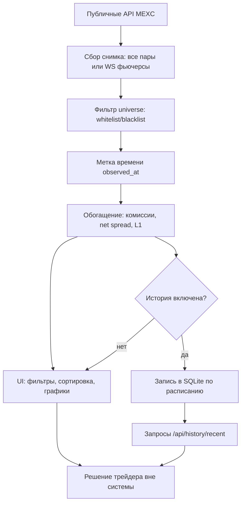

# Бизнес-процессы и трейдерская логика MEXC Spread Monitor

Документ описывает систему с **экономической и операционной** точки зрения: что именно измеряется, какие решения это поддерживает, какие допущения заложены и где границы применимости. Техническая схема модулей — в [ARCHITECTURE.md](ARCHITECTURE.md); установка и запуск — в [ZAPUSK.md](ZAPUSK.md).

---

## 1. Назначение продукта

**MEXC Spread Monitor** — инструмент **наблюдения** за ликвидностью на **споте** и **USDT-M фьючерсах** MEXC по **публичным данным** (без API-ключей и без размещения ордеров).

Типичные сценарии использования:

| Сценарий | Что делает пользователь | Что даёт система |
|----------|-------------------------|------------------|
| Сканирование рынка | Смотрит таблицу/плитки по сотням пар | Лучший bid/ask, спред в bps, объёмы 24h, funding на фьючерсах |
| Отбор идей | Задаёт фильтры (котировка, мин. спред, мин. оборот, поиск) | Узкий список кандидатов без ручного перебора |
| Оценка «запаса» после комиссий | Настраивает taker в bps в `execution` | Колонка **чистого спреда** (консервативная модель) |
| Проверка размера на L1 (спот) | Смотрит L1 max в USDT-экв., задаёт reference notional | Флаг «хватает ли объёма на лучшем уровне под эталонный размер» |
| Накопление истории | Включает `history` в конфиге | Периодические снимки в SQLite для последующего анализа |
| Экспорт | Скачивает CSV из UI | Срез с учётом фильтров и всех вычисляемых колонок |

Система **не** является торговым роботом, **не** исполняет сделки и **не** заменяет риск-менеджмент или бэктест с полным стаканом.

---

## 2. Бизнес-сущности и метрики

### 2.1. Одна строка таблицы = одна торговая пара

- **Спот:** символ в стиле биржи, например `BTCUSDT`.
- **Фьючерсы:** контракт, например `BTC_USDT`.

Каждая строка соответствует **одному моменту времени съёма** (`observed_at`, UTC, ISO8601): все строки одного запроса делят одну метку.

### 2.2. Гросс-спред (как на экране «в лоб»)

- **Абсолютный спред:** `ask − bid`.
- **Относительный спред (bps):** \(10\,000 \times (ask - bid) / mid\), где `mid = (bid + ask) / 2`.

Интерпретация: насколько широко расставлены лучшие цены **в момент снимка**. Это **не** гарантированная прибыль: между просмотром и ордером книга меняется.

### 2.3. Чистый спред (модель комиссий)

В конфигурации задаётся **taker в одну сторону** (в **bps**) отдельно для спота и фьючерсов. Система считает **круговой taker**:

- **Комиссия round-trip (bps)** = `2 × taker(one-way)` — упрощённо: покупка по ask и продажа по bid обе стороны как taker.
- **Чистый спред (bps)** = `гросс spread_bps − fee_round_trip_bps`.

Это **консервативная** оценка для сценария «обе ноги съели спред по тейкеру». Реальность может быть лучше (maker, скидки, VIP) или хуже (проскальзывание, частичное исполнение) — см. раздел об ограничениях.

### 2.4. Объём и ликвидность на лучшем уровне (L1)

- **Спот:** из API приходят `bidQty` и `askQty` на лучшем уровне.
- **Оценка максимума в базовом активе** (для одновременного «съесть» и bid, и ask на касании):  
  `l1_max_executable_base ≈ min(bid_qty, ask_qty)`.
- **В USDT-эквиваленте (оценочно):** `l1_max_notional_quote = l1_max_executable_base × mid`.

**Фьючерсы:** в используемом эндпоинте тикера **часто нет** количеств на L1 в интеграции → в таблице qty и L1-метрики могут быть **нулевыми**. Это означает «модель L1 по размеру **не информативна**», а не «нет ликвидности».

### 2.5. Эталонный размер сделки (reference notional)

Если в конфиге `execution.reference_quote_notional > 0` (USDT-экв.), система выставляет флаг **L1 ≥ ref**: хватает ли оценочного L1-notional под этот размер. Удобно для быстрого отсечения пар, где на касании теоретически не помещается нужный объём (на споте при наличии qty).

### 2.6. Объёмы 24h и funding

- **Спот:** объём в базе и в котировке из `ticker/24hr`.
- **Фьючерсы:** `volume24` / `amount24` и **funding rate** из контрактного тикера.

Funding важен для **переноса** позиции во времени, но **не** входит в формулу «чистого спреда» в текущей версии — это отдельный слой экономики при удержании.

---

## 3. Как устроен бизнес-процесс «от данных до решения»

1. **Сбор:** периодический опрос REST (и опционально WebSocket для фьючерсных тикеров) — см. архитектуру.
2. **Сужение universe:** только нужные символы (меньше шума в UI и в истории при фильтрации на этапе строк).
3. **Интерпретация:** гросс vs net, L1 vs «нужный размер».
4. **Действие человека:** отбор пар, ручной ордер, другой инструмент — система **не** шлёт ордера.

---

## 4. Нестационарность рынка (почему цифры «истекают»)

| Фактор | Влияние на интерпретацию |
|--------|---------------------------|
| Задержка опроса | Между снимками спред и книга уже другие |
| Очередь ордеров | Лучшая цена может исчезнуть до вашего лимита |
| Частичная ликвидность L1 | Реальный исполняемый объём может быть меньше видимого |
| Комиссии и статус аккаунта | Фактические bps отличаются от конфигурации |
| Фьючерсы без L1 qty | Нельзя судить о размере на касании из этого монитора |

Рекомендуемая дисциплина: смотреть **observed_at**, не полагаться на один снимок для крупного размера, при необходимости включать **историю** и смотреть устойчивость метрик во времени.

---

## 5. Межрынковый спред (спот ↔ фьючерс): зачем отдельная логика

Сейчас монитор строит **независимые снимки**: спот (`BTCUSDT`) и фьючерс (`BTC_USDT`) живут в разных таблицах и вкладках. **Базис** (разница цен спот vs бессрочный/квартальный контракт на тот же актив), **имплайд** (какую доходность «вшивает» рынок в премию/дисконт фьючерса к споту до следующих фандингов/экспирации) и **межрынковый арбитраж** требуют **сопоставления пар** и **согласованного времени** двух рядов.

Ниже — для **каких сценариев** без этой логики обойтись трудно или нельзя; для остальных достаточно текущего «внутрирынкового» спреда.

### 5.1. Сценарии, где межрынковая логика **нужна или сильно желательна**

| Сценарий | Суть | Что даёт сопоставление спот ↔ perp |
|----------|------|--------------------------------------|
| **Cash-and-carry / reverse cash-and-carry** | Купить дешевле / продать дороже на одном «ноге», хеджировать другой (спот vs фьючерс) | Базис в USDT и в bps к споту, знак премии, устойчивость во времени; оценка, покрывают ли базис и объёмы комиссии и риск |
| **Сканирование межрынкового арбитража на одной бирже** | Найти пары, где перп заметно дороже/дешевле спота при сопоставимой ликвидности | Единая таблица «актив → спот mid, perp mid, базис bps, funding», сортировка по базису, а не только по внутриспотовому спреду |
| **Учёт стоимости переноса (carry)** | Решить, есть ли «запас» после ожидаемых платежей funding / до экспирации | Связка **базиса** с **текущим и историческим funding** (и при необходимости — с днями до ролла/экспирации для не-перпов) |
| **Хеджирование спота перпом (или наоборот)** | Дельта-нейтральная позиция между рынками | Контроль **базисного риска**: насколько расходятся цены исполнения; алерты при расширении базиса |
| **Имплайд доходности (упрощённо)** | Сравнить премию фьючерса к споту с тем, что «ожидает» рынок от funding | Метрики вида имплайд-компоненты (в bps до следующего события) — для **дисклеймера и ориентира**, не замена полноценному pricing-моделированию |
| **Исследования и бэктесты** | Восстановить ряд «спот vs фьючерс» по истории | История с **одним `observed_at`** на связку символов, а не два несвязанных ряда |

### 5.2. Сценарии, где **достаточно текущего продукта** (без базиса)

| Сценарий | Почему хватает раздельных снимков |
|----------|-------------------------------------|
| Поиск **широкого внутриспотового** или **внутрифьючерсного** спреда | Нужны только bid/ask **одного** рынка |
| Отбор по обороту / funding **только на фьючерсах** | Достаточно вкладки фьючерсы |
| Мониторинг **только спота** (листинг, альткоины) | Спот-снимок изолирован |

### 5.3. Что потребуется **помимо** сопоставления символов

Даже после маппинга `BTCUSDT` ↔ `BTC_USDT` остаются продуктовые вопросы:

- **Одинаковый момент времени** для обеих ног (или явная модель допустимого лага).
- **Одинаковая «единица»** (mid vs bid/ask в направлении сделки; для арбитража важна сторона покупки/продажи).
- **Комиссии на обеих ногах** и возможные **ограничения** (займ, переводы, маржа) — в публичном мониторе обычно только намёк через конфиг.
- **Контракт ≠ всегда 1:1 к споту** (индексы, коэффициенты, иные мультипликаторы) — для экзотики нужен справочник, а не только строковая замена `_`.

Итог: межрынковая логика **оправдана**, когда бизнес-вопрос формулируется как **«сколько стоит связка спот + фьючерс»** или **«где перп относительно спота»**, а не **«насколько широк стакан внутри одного инструмента»**.

---

## 6. Конфигурация с точки зрения бизнеса

Файл **`config/external_apis.json`** (и переменные окружения — см. `_comment` в JSON и [ARCHITECTURE.md](ARCHITECTURE.md)):

| Блок | Бизнес-смысл |
|------|----------------|
| `mexc.spot` / `mexc.futures` | Эндпоинты; `symbols_whitelist` / `symbols_blacklist` — universe |
| `execution` | Taker bps и эталонный notional для net spread и флага L1 |
| `history` | Включение лога в SQLite, путь, интервал, рынки |
| `mexc` HTTP / WS | Таймауты, retry, опционально фьючерсы через WebSocket |

После смены конфигурации нужен **перезапуск** Python-процессов.

---

## 7. Риски и дисклеймер

- Данные **публичные** и **без гарантий** со стороны биржи и автора проекта.
- Метрики **образовательные и аналитические**; торговые решения и ответственность за финансовый результат остаются за пользователем.
- **Чистый спред** — модельная величина при заданных допущениях, не «гарантированная маржа».

---

## 8. Связанные документы

- [ARCHITECTURE.md](ARCHITECTURE.md) — модули, API, ORM, история, исполнение в коде.
- [ZAPUSK.md](ZAPUSK.md) — запуск Streamlit и современного UI.
- [README.md](../README.md) — обзор и ссылки.
